# 1 Maquetación ou _layout_

## 1.0 consellos

Abordar só un problema á vez:

1. Retículas.
2. Cores.
3. Fontes.
4. Fotos.
5. Animacións.
6. Vídeos.

## 1.1 Retículas (_grids_)

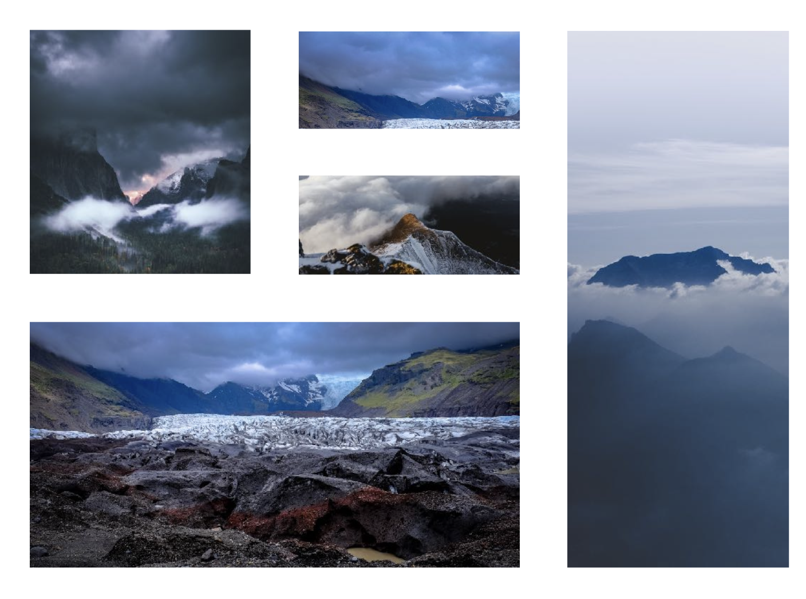

- Proporcionan orde ao caos.
- Xa se usaban para deseñar cidades na antigüidade (axudaba moito a atopar as rúas).

## 1.2 Equilibrio mediante simetría

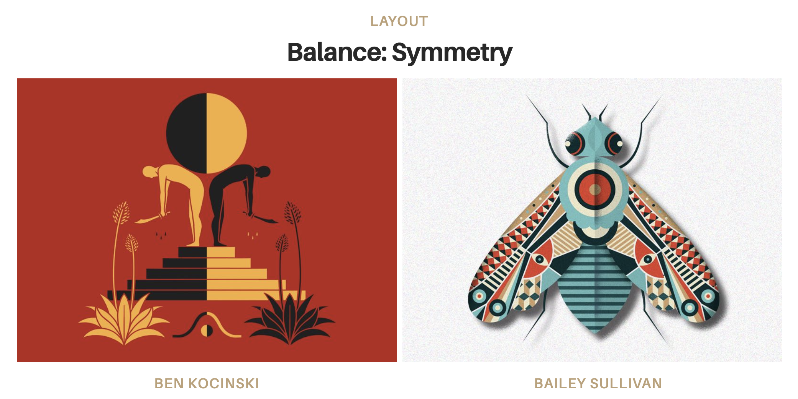

- É dicir a harmonía que produce algo simétrico (que se espella a ambos os dous lados).
- Moi usado en arquitectura (e tamén na arte en xeral).
- **Consello UX**: cando nun entorno simétrico rachamos coa simetría, captamos inmediatamente a atención de quen o observa. Importa telo en conta para poder usalo.
- A simetría é harmónica pero tende a aburrir e soémos xulgar un deseño web simétrico coma básico, sen chispa, sen nada relevante que recordar ou comentar coas nosas amigas.

## 1.3 Equilibrio mediante asimetría

### 1.3.1 Asimetría na arte e na web

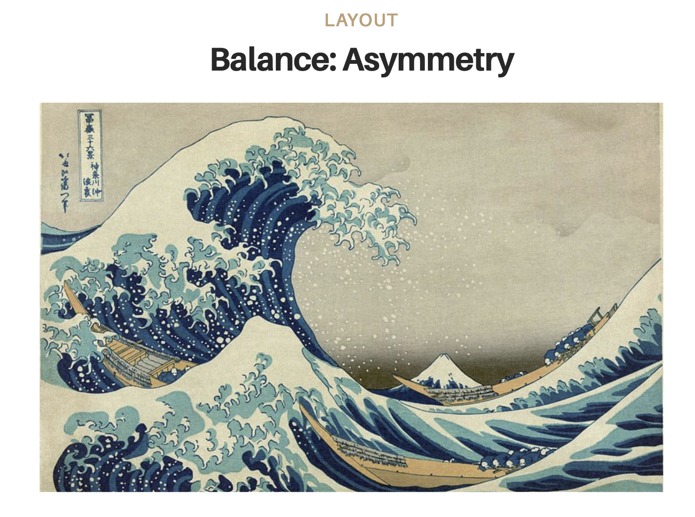

- Non é tan intuitivo como conseguir equilibrio (ou harmonía) mediante a simetría.
- Incluso a asimetría ten reglas.

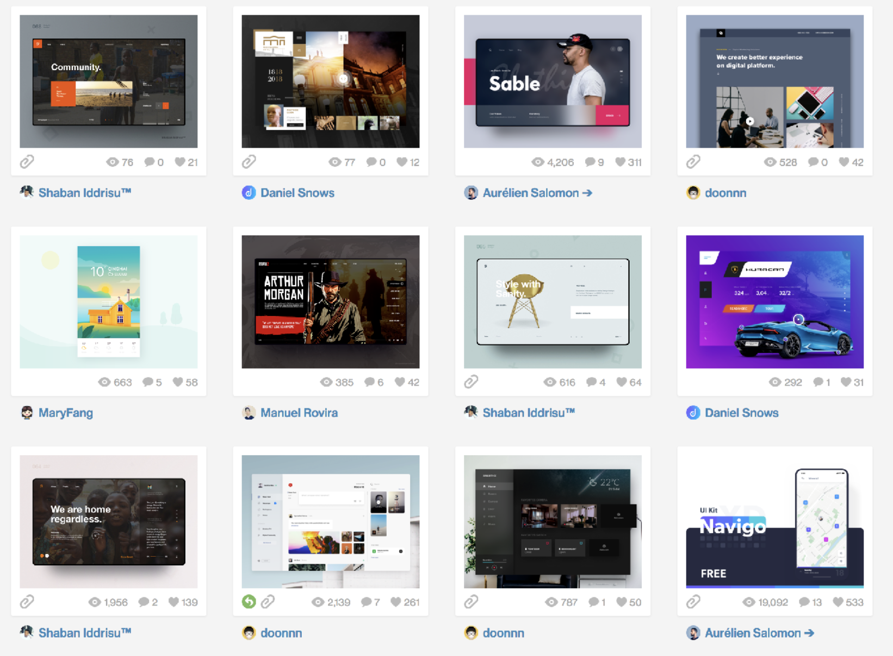

### 1.3.2 侘寂 (Wabi Sabi)

- [侘寂 na wikipedia](https://es.wikipedia.org/wiki/Wabi-sabi): na estética tradicional xaponesa 侘寂 (Wabi Sabi) é unha cosmovisión baseada na transitoriedade (transiencia) e a imperfección​.
- É o perfecto exemplo de beleza e imperfección.

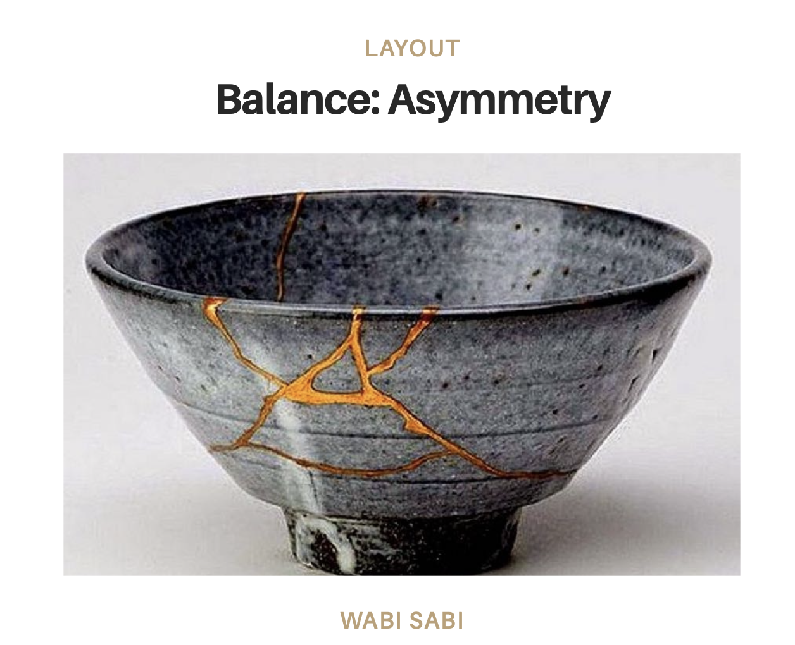

## 1.4 Asimetría: aprendendo da arte

### 1.4.1 A regra dos tercios

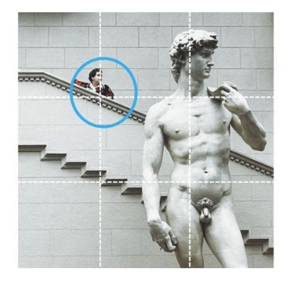

- É unha desas _"regras ocultas"_ da asimetría.
- Ven da fotografía e polo tanto é tamen moi utilizada na composición de imaxes cinematográficas.

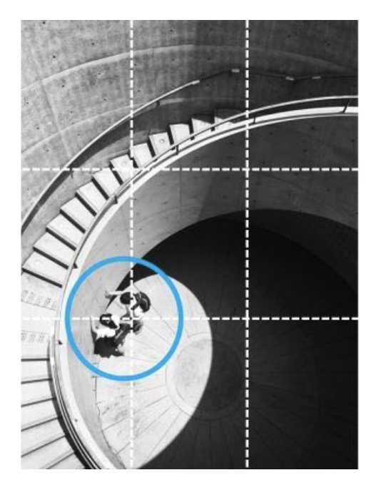

### 1.4.2 Composición en triángulo (triad composition)

- Outra desas _"regras ocultas"_ da asimetría.

#### 1.4.2.1 [Caravaggio](https://es.wikipedia.org/wiki/Caravaggio)

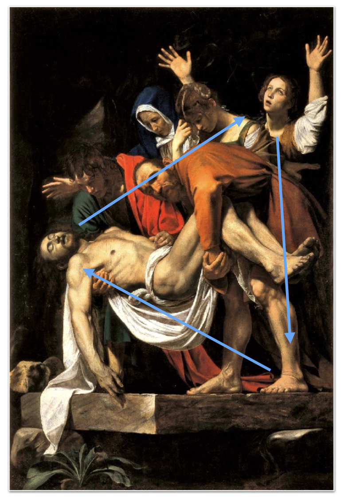

- Moi usada en pintura (sobre todo en pinturas post-Caravaggio).

#### 1.4.2.2 Atrapado no lienzo/deseño

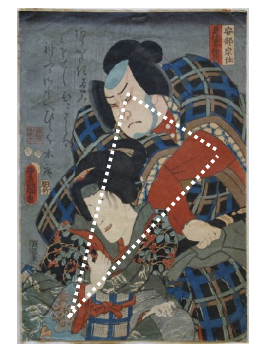

- Unha das razóns de ser que ten é que evita que coa vista _"saias do lienzo"_, xa que tes unha tendencia a seguir o triángulo unha e outra vez.

#### 1.4.2.3 Deseño suizo

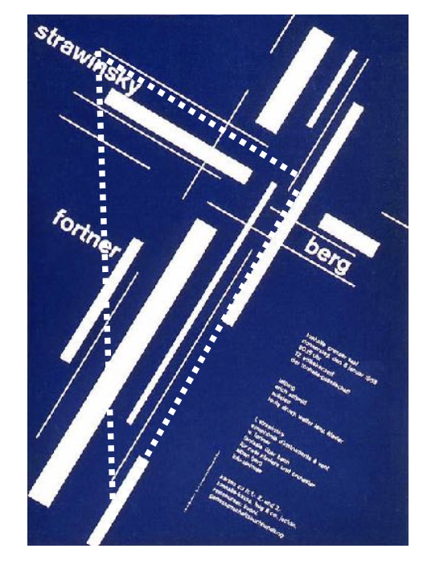

- O denominado [_deseño suizo_](https://99designs.com/blog/design-history-movements/swiss-design/) usa e abusa desta técnica.
- Pode ser unha gran fonte de inspiración.

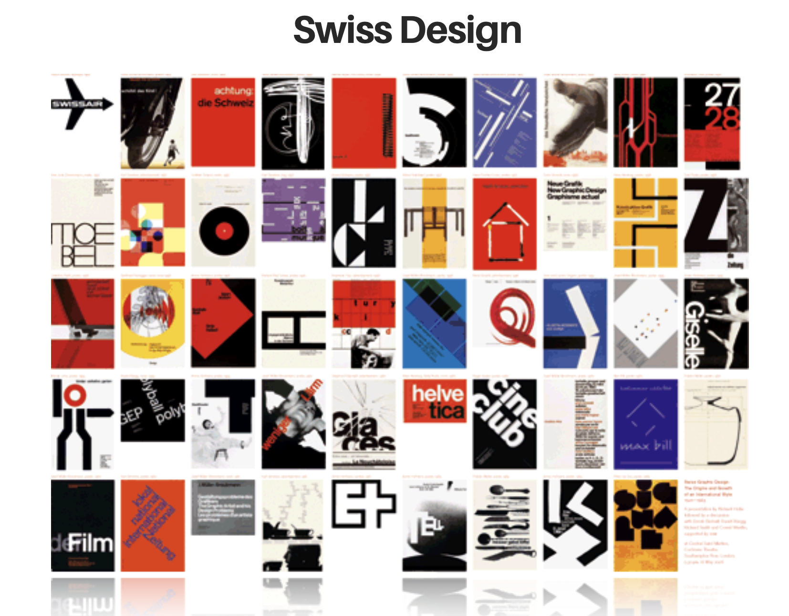

## 1.5 Formas xeométricas

### 1.5.1 Os círculos

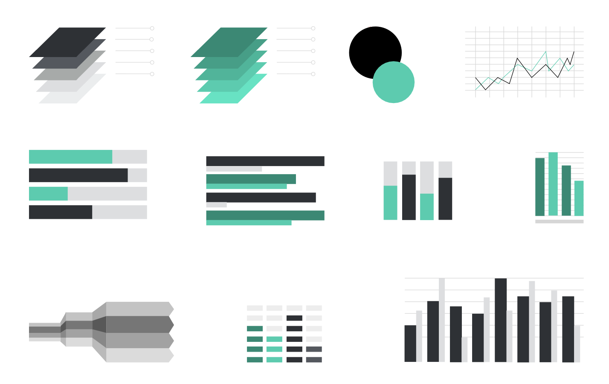

- Os círculos tenden a trapar a nosa atención máis que ningunha outra forma xeométrica (probablemente pola necesidade que temos de recoñecer a outros seres humanos: teoría dos ollos e facianas)

### 1.5.2 _Saccade_ ou movementos sacádicos

- [**_Saccade_** ou **movemento ocular sacádico**](https://es.wikipedia.org/wiki/Movimientos_sac%C3%A1dicos): a finalidade dos **movementos sacádicos** pode ilustrarse mediante o ollo. Os humanos, polo xeral, non miran unha escena de forma estática. No canto disto, os ollos móvense, buscando as partes interesantes e construíndo un mapa mental referente a ela

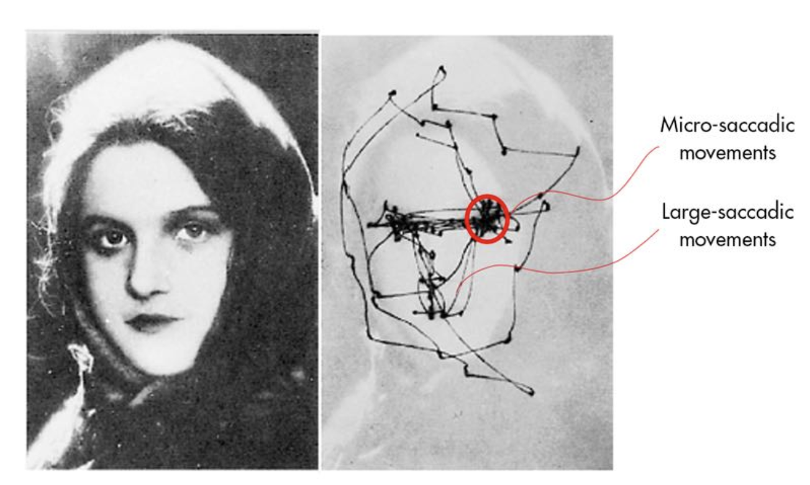

### 1.5.3 Corolarios _saccade_

- As cousas que se moven son as que máis chaman a nosa atención (pensade en cando a humanidade tiña que convivir con depredadores, ou vivir da caza).
- As cores brillantes capturan a nosa atención (pensade nos froitos dunha árbore).

### 1.5.4 CSS pro-tip `margin-left: -5`

A **alineación dos círculos** é 😱😱😱 _lixeiramente desalineada_ 😱😱😱.

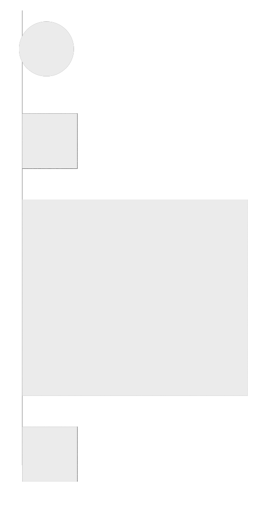

### 1.5.5 As diagonais e o dinamismo

- Recurso moi interesante xa que **permite rachar co deseño baseado en táboas e retículas**.

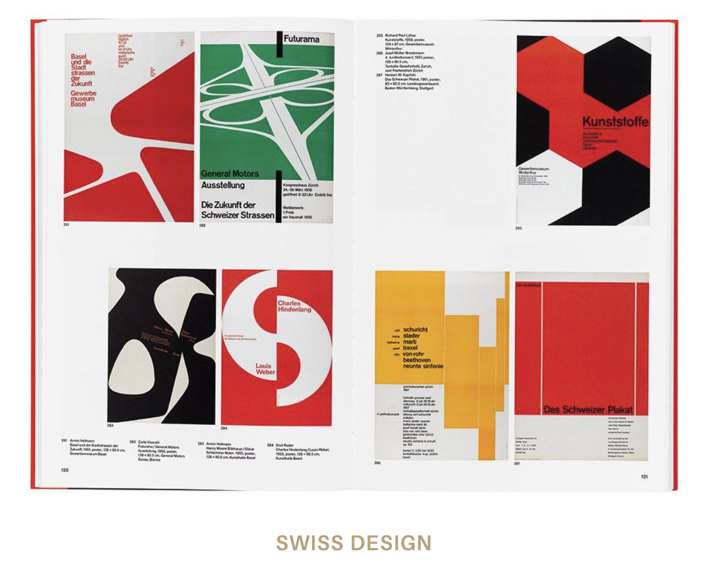

## 1.6 Escala e recorte (Scale & Cropping)

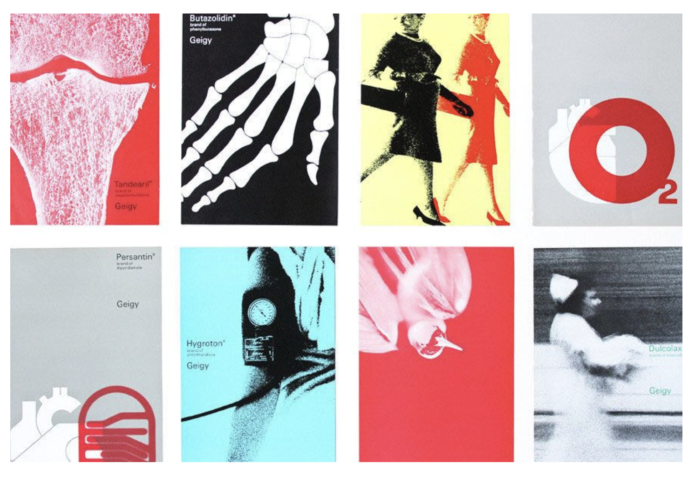

- Cambiar a escala das cousas **radicalmente** transforma as imaxes.
- Recortar as imaxes **de xeito _"non natural"_** tamén axuda coa súa transformación.
- Fixádevos na imaxe de fondo e como aporta dinamismo á táboa que se atopa en primeiro plano.

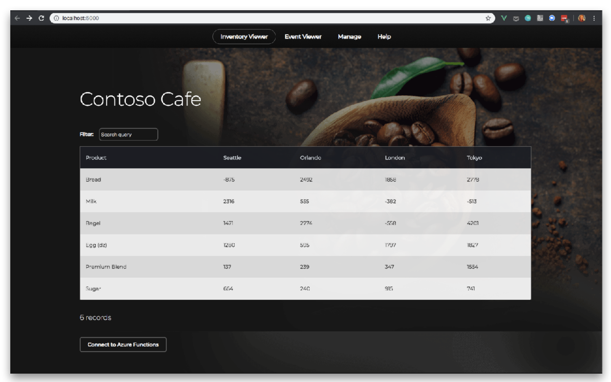

## 1.7 A retícula (grid)

### 1.7.1 A biblia

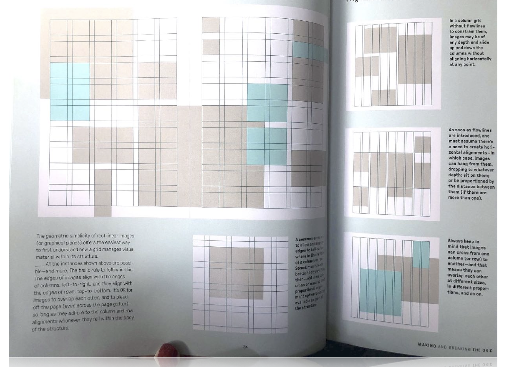

- É fundamental entender as retículas, incluso para logo **non utilizalas**. É un concepto fundamental do deseño.
- Compre saber **cando romper a retícula**: se un deseño é moi sistemático, enton é moi predecible (sinónimo neste caso de aburrido).

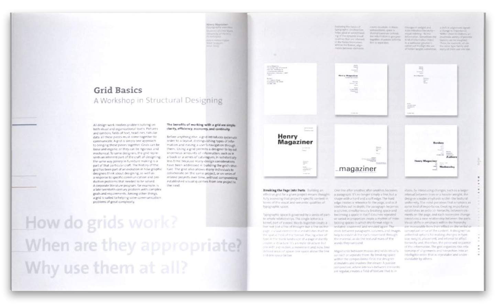

- Libro: [_"Making and breaking the grid"_ de Timothy Samara](https://designopendata.files.wordpress.com/2014/06/making_and_breaking_the_grid__timothy_samara.pdf).

### 1.7.2 Retículas e ancorado

- Existe un _"efecto áncora"_ moi importante na **sicoloxía**.

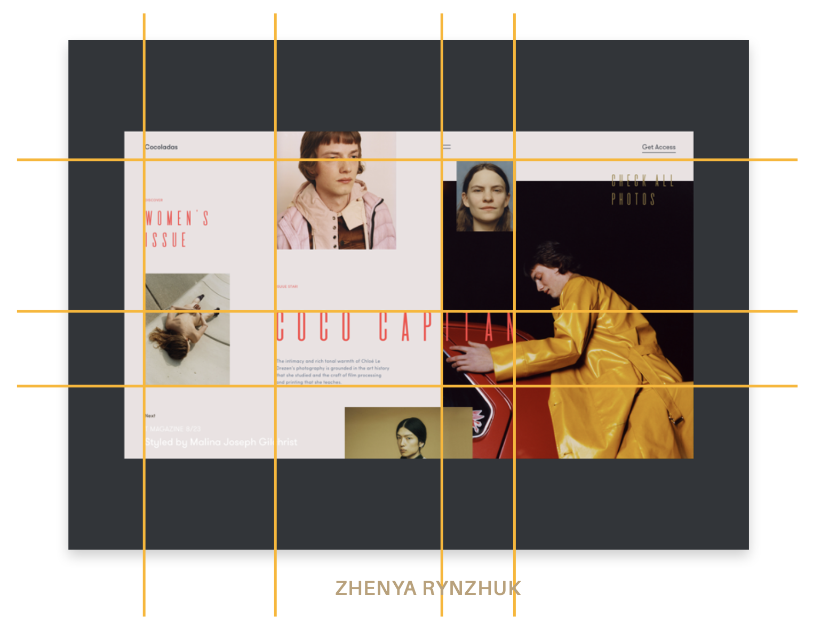

- Incluso cando **non se ve a retícula**, a relación entre retículas e ancorado nos elementos dun deseño é moi importante.
- Dito doutro xeito, o ancorado a retículas invisibles dá cohesividade ao deseño.

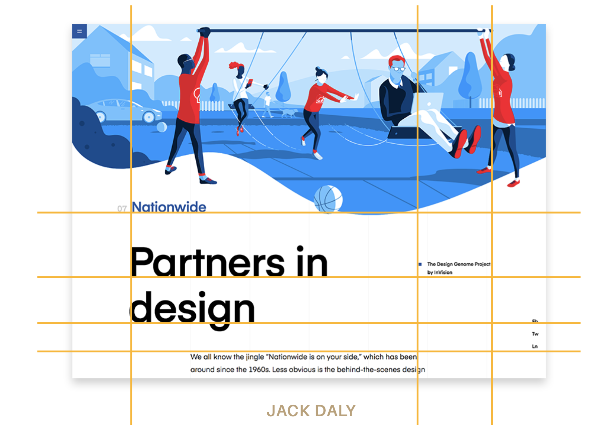

## 1.8 Ferramentas de maquetación

- **Photoshop / GIMP**: útil para jpgs, bitmaps,  máscaras, tranparencias, efectos, filtros
- **Illustrator / Inkscape**: vectores, svgs.
- **Sketch**: a ferramenta máis moderna e recente. Arrasou na nova xeración de deseñadoras. Moi eficiente á hora de agrupar múltiples ideas nun só sitio; por exemplo, podemos ter nun mesmo _artboard_ unha vista máis orientada a un monitor, a un mobil e a unha tablet.
