# Funcións ou JS funcional

## Aclaración

> _Orixinalmente creei este material para a asignatura TIC de 1º de Bacherelato no IES Fernando Wirtz Suárez. Carece de contexto inicial (as clases presencias que dera antes destes apuntamentos)._

Para poder executar e xogar co código tedes dúas opcións:

1. Facelo localmente na consola do Firefox (ou Chrome).
2. Ir a [Codepen.io](https://codepen.io/).

As **capturas de código (imaxes)** están sacadas directamente da **consola de Firefox**

### Como abrir a consola do Firefox

Mediante atallo de teclado:

- Windows ou Ubuntu: **Ctrl + Shift + I** ou **F12** e logo ➤ Consola.
- MacOS: **⌘ + ⌥ + I** e logo ➤ Consola.

Mediante o menú:

- Menú ➤ Máis ferramentas ➤ Ferramentas do desenvolvemento ➤ Consola.

### 👁 Gotcha 👁 Codepen

Se queredes executar o código en [Codepen.io](https://codepen.io/), cada vez que executedes unha instrución que vaia sacar resultados pola consola, teredes que envolvela nun `console.log`.

Por exemplo

```js
// Na consola do Firefox 👇
add(1);

// En Codepen.io 👇
console.log(
  add(1)
);
```

## Índice

- [1.1 Definición dunha función](#11-definición-dunha-función)
- [1.2 Invocación dunha función](#12-invocación-dunha-función)
- [1.3 Anatomía dunha función (definición e invocación)](#13-anatomía-dunha-función-definición-e-invocación)
- [1.4 Clasificación das funcións](#14-clasificación-das-funcións)
- [1.5 `undefined` e `return`](#15-undefined-e-return)
- [1.6 Efectos secundarios nas funcións](#16-efectos-secundarios-nas-funcións)
- [1.7 Exemplo](#17-exemplo)
- [1.8 `map`, `filter` e `reduce`](#18-map-filter-e-reduce)
   - [1.8.1 `<array>.map(function)`](#181-arraymapfunction)
   - [1.8.2 `<array>.filter(function)`](#182-arrayfilterfunction)
   - [1.8.3 `<array>.reduce(function)`](#183-arrayreducefunction)
- [1.9 Funcións anónimas, Arrow Functions e Lambda Functions](#19-funcións-anónimas-arrow-functions-e-lambda-functions)
   - [1.9.1 Inconsistencias](#191-inconsistencias)
   - [1.9.2 `return` implícito](#192-return-implícito)
- [INTERLUDIO: Interpolación de Strings](#interludio-interpolación-de-strings)
- [INTERLUDIO: Emojis e Strings](#interludio-emojis-e-strings)
- [1.10 ¿Por qué existen os parámetros?](#110-por-qué-existen-os-parámetros)
   - [1.10.1 O problema](#1101-o-problema)
   - [1.10.2 A solución](#1102-a-solución)
   - [1.10.3 Conclusión](#1103-conclusión)
- [1.11 O caso de `"hello".toUpperCase()`](#111-o-caso-de-hellotouppercase)
   - [1.11.1 O primeiro problema](#1111-o-primeiro-problema)
   - [1.11.2 O segundo problema](#1112-o-segundo-problema)
   - [1.11.3 A solución](#1113-a-solución)
   - [1.11.4 Conclusion](#1114-conclusion)
   - [1.11.5 Exercicio](#1115-exercicio)
- [1.12 `myMap`, `myFilter`, `myReduce`](#112-mymap-myfilter-myreduce)
   - [1.12.1 `<array>.map(function)`](#1121-arraymapfunction)
   - [1.12.2 `myMap(coleccion, funcion)`](#1122-mymapcoleccion-funcion)
   - [1.12.3 `<array>.filter(function)`](#1123-arrayfilterfunction)
   - [1.12.4 `myFilter(coleccion, predicado)`](#1124-myfiltercoleccion-predicado)
   - [1.12.5 `<array>.reduce(function)`](#1125-arrayreducefunction)
   - [1.12.6 `myReduce(coleccion, funcion)`](#1126-myreducecoleccion-funcion)
- [1.13 Notación xeral sobre tipos e funcións](#113-notación-xeral-sobre-tipos-e-funcións)
   - [1.13.1 `add1`](#1131-add1)
   - [1.13.2 `add`](#1132-add)
   - [1.13.3 `<string>.toUpperCase` e `yell`](#1133-stringtouppercase-e-yell)
   - [1.13.4 `<string>.toLowerCase` e `chillTheFunkOut`](#1134-stringtolowercase-e-chillthefunkout)
   - [1.13.5 `<array>.map(function)` e `myMap`](#1135-arraymapfunction-e-mymap)
   - [1.13.6 `<array>.filter(predicate)` e `myFilter`](#1136-arrayfilterpredicate-e-myfilter)
   - [1.13.7 `<array>.reduce(function)` e `myReduce`](#1137-arrayreducefunction-e-myreduce)
   - [1.13.8 Consideracións extra](#1138-consideracións-extra)
   - [1.13.9 Derivando unha fórmula xenérica para `myMap`](#1139-derivando-unha-fórmula-xenérica-para-mymap)
   - [1.13.10 Cal é o tipo da función `Fn` que aparece en `myMap`?](#11310-cal-é-o-tipo-da-función-fn-que-aparece-en-mymap)
- [1.14 Exemplo de tipos visto na clase: `myMap` e `String`s](#114-exemplo-de-tipos-visto-na-clase-mymap-e-strings)
   - [1.14.1 Definición e uso de `myMap` e `add100`](#1141-definición-e-uso-de-mymap-e-add100)
   - [1.14.2 Definición e uso de `myMap` e `yell`](#1142-definición-e-uso-de-mymap-e-yell)
   - [1.14.3 Renomeado](#1143-renomeado)
   - [1.14.4 Podemos renomear 2 veces?](#1144-podemos-renomear-2-veces)
- [1.15 As 3 cousas que podemos facer coas funcións](#115-as-3-cousas-que-podemos-facer-coas-funcións)
   - [1.15.1 Definilas](#1151-definilas)
      - [1.15.1.1 _Function definition_, _function declaration_ ou _function statement_](#11511-function-definition-function-declaration-ou-function-statement)
      - [1.15.1.2 _Lambda Functions_ o _Arrow Functions_](#11512-lambda-functions-ou-arrow-functions)
   - [1.15.2 Invocalas](#1152-invocalas)
      - [1.15.2.1 GOTCHA - COIDADO](#11521-gotcha---coidado)
   - [1.15.3 Usalas como valores](#1153-usalas-como-valores)
      - [1.15.3.1 Exemplo de renomeado](#11531-exemplo-de-renomeado)
      - [1.15.3.2 Exemplo de argumentos de funcións](#11532-exemplo-de-argumentos-de-funcións)
      - [1.15.3.3 Exemplo de retornado de función](#11533-exemplo-de-retornado-de-función)
      - [1.15.3.4 GOTCHA - COIDADO](#11534-gotcha---coidado)
- [1.16 Definir e invocar funcións inmediatamente (IIFE)](#116-definir-e-invocar-funcións-inmediatamente-iife)
   - [1.16.1 Exercicio 1a: ⁉️ Exemplo IIFE (1)](#1161-exercicio-1a-️-exemplo-iife-1)
   - [1.16.2 Exercicio 1b: ⁉️ Exemplo IIFE (2)](#1162-exercicio-1b-️-exemplo-iife-2)
   - [1.16.3 Exercicio 1c: ⁉️ Exemplo IIFE (3)](#1163-exercicio-1c-️-exemplo-iife-3)
- [1.17 Statements vs Expressions](#117-statements-vs-expressions)
   - [1.17.1 Exercicio 1a: ⁉️ qué devolve (`return`) a definición dunha función?](#1171-exercicio-1a-️-qué-devolve-return-a-definición-dunha-función)
   - [1.17.2 Exercicio 1b: ⁉️ qué devolve (`return`) a definición dunha Lambda?](#1172-exercicio-1b-️-qué-devolve-return-a-definición-dunha-lambda)
   - [1.17.3 Definicións: _statement_ e _expression_](#1173-definicións-statement-e-expression)
   - [1.17.4 Exemplos: _statements_ e _expressions_](#1174-exemplos-statements-e-expressions)
- [1.18 `console` Object e o caso dos obxectos tramposos 🕵️‍♀️🔍](#118-console-object-e-o-caso-dos-obxectos-tramposos-️️)
   - [1.18.1 Métodos](#1181-métodos)
   - [1.18.2 Tarefa: Inspeccionar 🔍 o obxecto `console` nas Dev Tools](#1182-tarefa-inspeccionar--o-obxecto-console-nas-dev-tools)
   - [1.18.3 Tarefa: Inspeccionar 🔍 os `array`s coma obxectos nas Dev Tools](#1183-tarefa-inspeccionar--os-arrays-coma-obxectos-nas-dev-tools)

## 1.1 Definición dunha función

```js
function add1(x) {
  return x + 1;
}
```

## 1.2 Invocación dunha función

```js
add1(9); // Devolve un 10
add1(4); // Devolve un 5
```

## 1.3 Anatomía dunha función (definición e invocación)

Imos poñerlle nome a cada unha das partes dunha función

```js
function magic(x, y, z) {
  return x + y - z;
}

magic(20, 12, 2); // Devolve 30
```

- `function` indica que estamos a definir unha función.
- `magic` é o nome que escollemos para a función.
- `x` é o primerio parámetro da función.
- `20` é o primeiro argumento da invocación da función (vai acabar substituindo a `x`).
- `y` é o segundo parámetro da función.
- `12` é o segundo argumento da invocación da función (vai acabar substituindo a `y`).
- `z` é o terceiro parámetro da función.
- `2` é o terceiro argumento da invocación da función (vai acabar substituindo a `z`).
- `(x, y, z)` é a lista de parámetros da función. A **orde** dos parámetros **importa**.
- `(20, 12, 2)`é a lista de argumentos da invocación da función.
- `{ return x + y - z; }` é o corpo (_body_) da función.
- `x + y - z` é o valor de retorno (está despois de `return`) da función.

## 1.4 Clasificación das funcións

Dende o punto de vista que estamos a defender na clase, podemos ver as funcións (unha vez definidas) coma caixas negras tal que

```
      -----------
      |         |
 IN → | FUNCIÓN | → OUT
      |         |
      -----------
```

É dicir, só nos interesan as entradas (**IN**) e saidas (**OUT**). Por exemplo, `magic` ten

- 3 entradas `(x, y, z)`
- 1 saida, o resultado de `x + y - z` que é un número e podemos chamarlle `q`

```
      -----------
  x → |         |
  y → | FUNCIÓN | → q (= x + y - z)
  z → |         |
      -----------
```

## 1.5 `undefined` e `return`

> _¿Que acontece cando facemos un `console.log('Ola')`?_

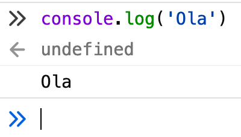

> _¿Qué é iso de `undefined`?_

Vexamos outro exemplo

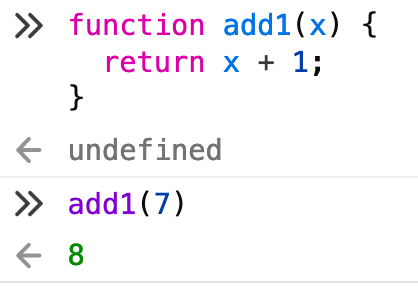

Cando tras a flecha cara a esquerda aparece `undefined`, significa que a función invocada non devolve nada...


É dicir:

- `console.log` non ten `return`.
- A definición dunha función con `function` non ten `return`.
- `add1` sí ten `return` (e devolve un `8`)

Podemos definir funcións que non devolven nada. Por exemplo (fixádevos como **non usamos `return`**)

```js
function noReturn(x) {
  x + 100;
}

noReturn(4);
```

Esto é o que acontece

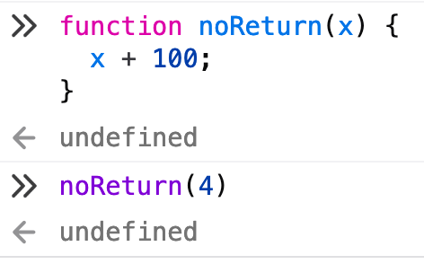

> _Pero entón, ¿cómo pode ser que `console.log` non devolva nada pero ainda así vexamos o resultado?_

A resposta... os **efectos secundarios**

## 1.6 Efectos secundarios nas funcións

Consideremos a seguinte función con moitos efectos secundarios (3, en concreto)

```js
function efectosSecundarios(x) {
  console.log(x + 100);
  console.log('Ola!!!');
  console.log('Aquí');
  return x + 50;
}

efectosSecundarios(20);
```

Fixádevos qué acontece

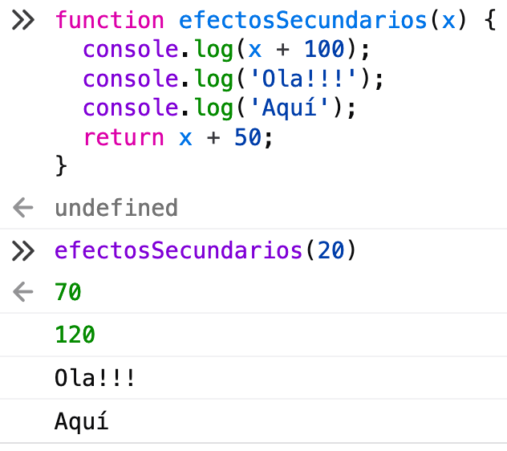

Debemos actualizar o concepto das caixas negras

```
      -----------
      |         |
 IN → | FUNCIÓN | → OUT
      |         |
      -----------
           ↓
        Efectos
      Secundarios

```

## 1.7 Exemplo

Podemos levar esta idea ainda máis aló. Considerade a seguinte función

```js
function efectosSecundariosAndNoReturn(x) {
  console.log(x + 100);
  console.log('Ola!!!');
  console.log('Aquí');
  x + 20;    // OLLO. NON HAI return
}

efectosSecundarios(50);
```

Fixémonos en qué acontece

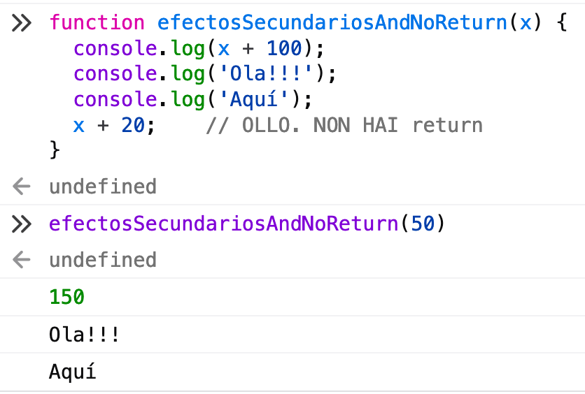

Efectivamente non hai `return` (mirade o `undefined` por riba do `150`) e temos 3 efectos secundarios.

Poderiamos dicir que `efectosSecundariosAndNoReturn` ten

- 1 entrada `x`
- 0 saidas (no `return`, daí o `undefined`)
- 3 efectos secundarios:
	- `150`
	- `Ola!!!`
	- `Aquí`

## 1.8 `map`, `filter` e `reduce`

Xa sabemos usar `map`, `filter` e máis `reduce`. Recordemos

```js
function add1(x) {
  return x + 1;
}

[10, 20, 30].map(add1);

function greaterThan15(x) {
  return x > 15;
}

[10, 20, 30].filter(greaterThan15);

function minus(acc, x) {
  return acc - x;
}

[10, 20, 30].reduce(minus);
```

### 1.8.1 `<array>.map(function)`

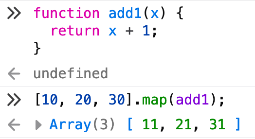

> _¿Qué tipo de función agarda `map` como argumento?_

Unha como `add1`. É dicir:

- 1 entrada (`x`)
- 1 saida (o resultado de facer `x + 1`)

Se `map` recibe como argumento unha función con características diferentes non vai funcionar. Por exemplo se recibe unha función con 3 entradas, falla.

### 1.8.2 `<array>.filter(function)`

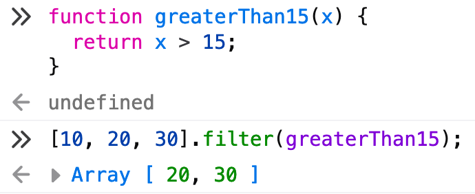

> _¿Qué tipo de función agarda `filter` como argumento?_

Unha como `greaterThan15`. É dicir:

- 1 entrada (`x`)
- 1 saida (o resultado de facer `x > 15`).

Pero neste caso ademais a saida debe ser ou `true` ou `false`. A este tipo de funcións chamámolas **predicados**.

Se `filter` recibe como argumento unha función con características diferentes non vai funcionar. Por exemplo se recibe unha función con 3 entradas falla ou se recibe unha función que non devolve `true` ou `false`.

### 1.8.3 `<array>.reduce(function)`

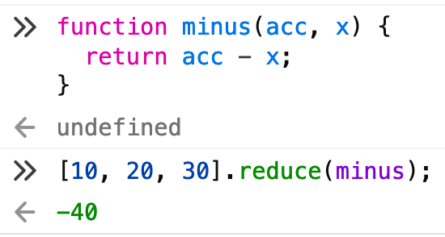

> _¿Qué tipo de función agarda `reduce` como argumento?_

Unha como `minus`. É dicir:

- 2 entradas (`acc`, `x`)
- 1 saida (o resultado de facer `acc - x`).

Neste caso preferimos poñer un nome máis descritivo aos parámetros da función `minus`. En lugar de `x`e `y` poñemos `acc` (diminutivo de `accumulator`) e `x` porque cando lla pasamos a `reduce` fai o seguinte:

1. `acc` toma o valor do primeiro número do array (`acc = 10`) e `x` o do segundo (`x = 20`).
2. executamos o `return` (`acc - x`) obtendo o valor `-10` (`10 - 20 = -10`). Este `-10` vai ser o valor do próximo `acc`.
3. `acc` toma o valor do último `return` (`acc = -10`) e `x` o do seguinte valor do array (`x = 30`).
4. executamos o `return` (`acc - x`) obtendo o valor `-40` (`-10 - 30 = -40`). Este `-40` sería o valor do próximo `acc` pero como xa baleiramos o array pasa a ser o valor resultado final de `reduce`.

As funcións como `minus`, **as veces**, reciben o nome de **reducers** ou **redutores**.

Se `reduce` recibe como argumento unha función con características diferentes non vai funcionar. Por exemplo se recibe unha función con 3 entradas ou con 1 entrada falla en ámbolos casos.

## 1.9 Funcións anónimas, Arrow Functions e Lambda Functions

Podemos definir **funcións anónimas** usando outra notación. Consideremos os exemplos de `map`, `filter` e `reduce` anteriores como punto de partida. O que aparece a continuación sería equivalente

```js
[10, 20, 30].map(num => num + 1);
[10, 20, 30].filter(num => num > 15);
[10, 20, 30].reduce((acc, num) => acc - num);
```

A proba

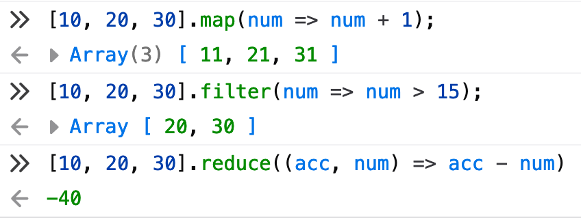

Agora resulta moito menos tedioso encadear operacións

```js
[10, 20, 30, 40, 50, 60, 70, 80]
  .map(num => num + 1)
  .filter(num => num > 15)
  .reduce((acc, num) => acc - num);
```

O resultado

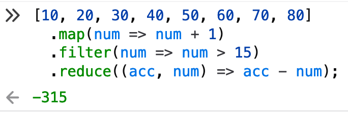

### 1.9.1 Inconsistencias

As **Arrow Functions** teñen algunha inconsistencia ao respecto da notación

```js
// 0 parámetros
() => 27;  ✅
   => 27;  ❌

// 1 parámetro
(x) => x + 10; ✅
 x  => x + 10; ✅

// 2 ou máis parámetros
(x, y, z) => x + y - z;  ✅
 x, y, z  => x + y - z;  ❌
```

### 1.9.2 `return` implícito

As Arrow Functions levan un `return` implícito, é dicir as duas funcións que veñen a continuación son equivalentes

```js
(x, y, z) => x + y - z;
(x, y, z) => return x + y - z;
```

## INTERLUDIO: Interpolación de Strings

> _Cómo podemos facer para intercalar partes variables nun texto ou `String`?_

Moi sinxelo.

1. Usamos \`\` para facer o `String`.
2. Usamos `${}` para encapsular o que queremos intercalar

```js
function useMe(text) {
  return `insert 👉 ${text} 👈`;
}

useMe("one two three");
useMe("four five six");
```

A proba

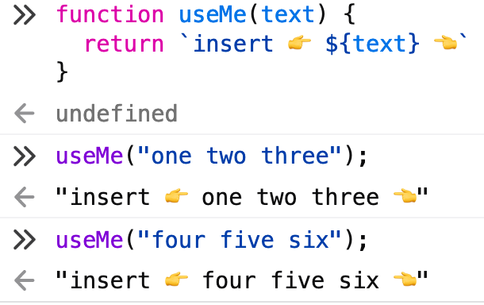

## INTERLUDIO: Emojis e Strings

Os emojis son Strings (texto). A proba... Mirade 👆.

## 1.10 ¿Por qué existen os parámetros?

### 1.10.1 O problema

Supoñamos que queremos facer unha función que me diga ola. Poderiamos pensar en facer algo coma

```js
function sayHiToDavid() {
  return "Hello David 👽👾🤖";
}
```

de xeito que poidamos invocala tal que así

```js
sayHiToDavid();
```

Imos ver que acontece

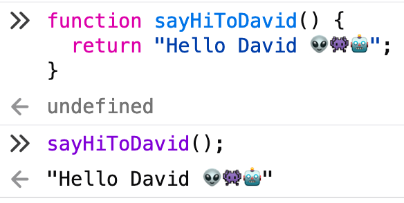

Funciona!!! 👽

O problema é que se queremos saudar a alguén que non sexa David temos que definir outra función diferente. Por exemplo

```js
function sayHiToYou() {
  return "Hello You 👽👾🤖";
}

sayHiToYou();
```

E poderiamos seguir así ata o infinito definindo e usando unha chea de funcións moi semellantes.

```js
function sayHiToInsertNameHere() {
  return "Hello insertNameHere 👽👾🤖";
}
```

A estas alturas xa vemos o problema. Somos moi concretos. Precisamos ser mais abstractos, que o nome da persoa que queremos saudar poida cambiar.... **ENTER PARAMETERS!** 🐉🐉🐉

### 1.10.2 A solución

En vez de facer unha chea de función chamadas `sayHiToDavid`, `sayHiToYou`, `sayHiToKim`, `sayHiToSetsuko` imos definir unha soa función xenérica que nos permita especificar o nome a través dun parámetro

```js
function sayHiTo(name) {
  return `Hello ${name} 👽👾🤖`;
}
```

e agora podemos invocala con moitos nomes diferentes sen facer funcións novas

```js
sayHiTo("David");
sayHiTo("You");
sayHiTo("Kim");
sayHiTo("Setsuko");
```

Comprobamos

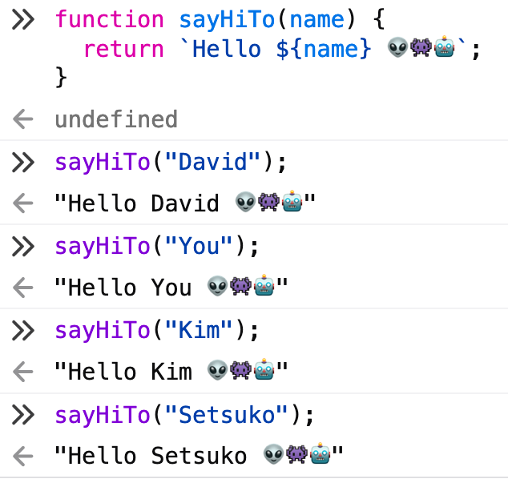

### 1.10.3 Conclusión

Os **parámetros** (`name`) / **argumentos** (`David`, `You`, `Kim`, `Setsuko`) permítennos _encapsular_ as cousas que mudan. Dalgún xeito poderiamos dicir que unha función só debe usar os datos que se lle pasan a través dos parámetros...

Pero entón... qué acontece con `"hello".toUpperCase()`?

## 1.11 O caso de `"hello".toUpperCase()`

### 1.11.1 O primeiro problema

A función `toUpperCase()` permite poñer en maiúsculas un texto (String)... pero funciona dun xeito raro, xa que o texto non vai como parámetro. Vexamos

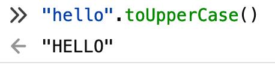

Porén, `toUpperCase("hello")` non funciona...


Non imos explicar neste momento que está a acontecer... xa que obligaríanos a falar dos **obxectos** e xa o faremos máis adiante... Pero ten que ver con onde se almacenan as funcións que nos da JavaScript xa feitas.

### 1.11.2 O segundo problema

Imos tentar usar `toUpperCase()` cun `<array de textos>.map` a ver que acontece

```js
["hello", "hallo", "hola", "ola"].map(yell);
```

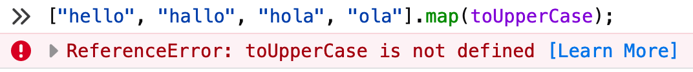

🤔🤔🤔

Analicemos a forma de `<texto>.toUpperCase()`:

- 0 entradas... `()`
- 1 saida, o texto en maiúsculas

Recordemos que `map` quere funcións como `add1(x)`

- 1 entrada
- 1 saida

### 1.11.3 A solución

> _Poderiamos crear unha función que grite (`yell`) que sexa compatible con `map` e use dentro `toUpperCase()`?_

Claro que podemos

```js
function yell(text) {
  return text.toUpperCase()
}

yell("me");
```

Aquí temos a proba


> _Pero, funciona con `map`?_

```js
["hello", "hallo", "hola", "ola"].map(yell);
```

Comprobemos

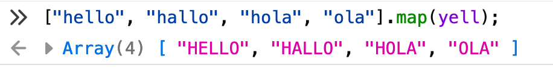

🥳🎉🎊

### 1.11.4 Conclusion

Se queremos usar unha función con `map` do estilo a `<text>.doSomething()` xa sabemos como convertila a `doSomething(text)`  para que funcione.

### 1.11.5 Exercicio

Probade con `"HELLO".toLowerCase()`. Convertídea para que funcione con `map`.

`.toLowerCase` funciona así

```js
"I'M ANGRY!".toLowerCase();
```

Tal e como podemos comprobar 👇


Entón podemos facer `chillTheFunkOut`

```js
function chillTheFunkOut(text) {
  return text.toLowerCase();
}

chillTheFunkOut("I'M ANGRY!");
```

Asegurámonos de que funcione 👇

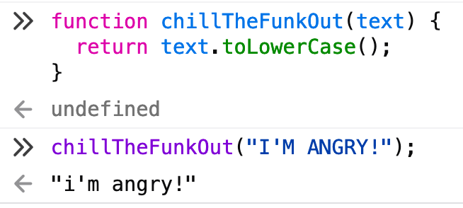

Que efectivamente funciona con `map`

```js
["hello", "hallo", "hola", "ola"].map(chillTheFunkOut);
```

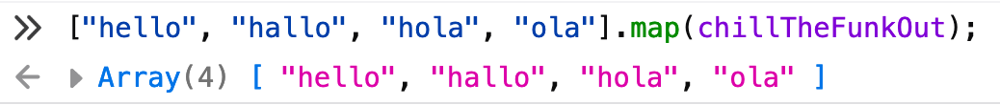

## 1.12 `myMap`, `myFilter`, `myReduce`

### 1.12.1 `<array>.map(function)`

Recordemos como funcionaba `map`

```js
[10, 20, 30, 40].map(x => x + 1);
```

É dicir

```
      -------
      |     |
 fn → | map | → colección
      |     |
      -------
```

Pero `map` fai trampas porque usa unha colección extra. No exemplo de arriba `[10, 20, 30, 40]`.

### 1.12.2 `myMap(coleccion, funcion)`

Queremos facer unha función `myMap` que siga a seguinte descrición

```
               ---------
  coleccion1 → |       |
               | myMap | → coleccion2
          fn → |       |
               ---------
```

e que internamente use `<array>.map(function)`.

```js
function myMap(coleccion, funcion) {
  return coleccion.map(funcion);
}

myMap(
  [10, 20, 30, 40],
  x => x + 1
);
```

Comprobamos

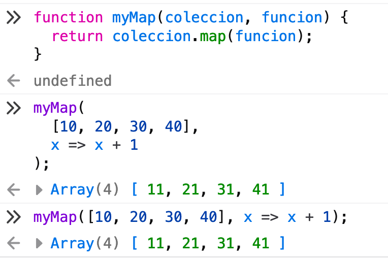

### 1.12.3 `<array>.filter(function)`

Recordemos como funcionaba `filter`

```js
[10, 20, 30, 40].filter(x => x > 15);
```

É dicir

```
      ----------
      |        |
 fn → | filter | → colección
      |        |
      ----------
```

Pero `filter` fai trampas (as mesmas trampas que `map`) porque usa unha colección extra. No exemplo de arriba `[10, 20, 30, 40]`.

### 1.12.4 `myFilter(coleccion, predicado)`

Queremos facer unha función `myFilter` que siga a seguinte descrición

```
               ------------
  coleccion1 → |          |
               | myFilter | → coleccion2
   predicado → |          |
               ------------
```

e que internamente use `<array>.filter(function)`.

```js
function myFilter(coleccion, predicado) {
  return coleccion.filter(predicado);
}

myFilter(
  [10, 20, 30, 40],
  x => x > 15
);
```

Comprobamos

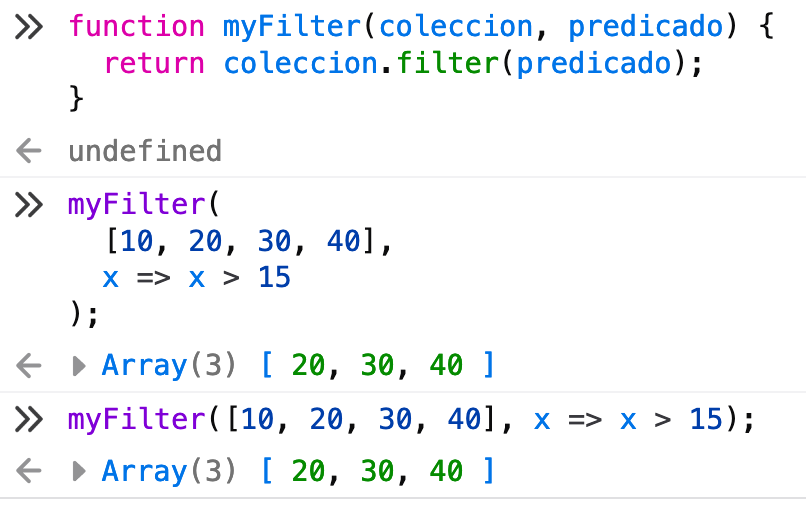

### 1.12.5 `<array>.reduce(function)`

Recordemos como funcionaba `reduce`

```js
[10, 20, 30, 40].reduce((x,y) => x + y);
```

É dicir

```
      ----------
      |        |
 fn → | reduce | → valor
      |        |
      ----------
```

Pero `reduce` fai trampas porque usa unha colección extra. No exemplo de arriba `[10, 20, 30, 40]`.

### 1.12.6 `myReduce(coleccion, funcion)`

Queremos facer unha función `myReduce` que siga a seguinte descrición

```
               ------------
  coleccion1 → |          |
               | myReduce | → valor
          fn → |          |
               ------------
```

e que internamente use `<array>.reduce(function)`.

```js
function myReduce(coleccion, funcion) {
  return coleccion.reduce(funcion);
}

myReduce(
  [10, 20, 30, 40],
  (x,y) => x + y
);
```

Comprobamos

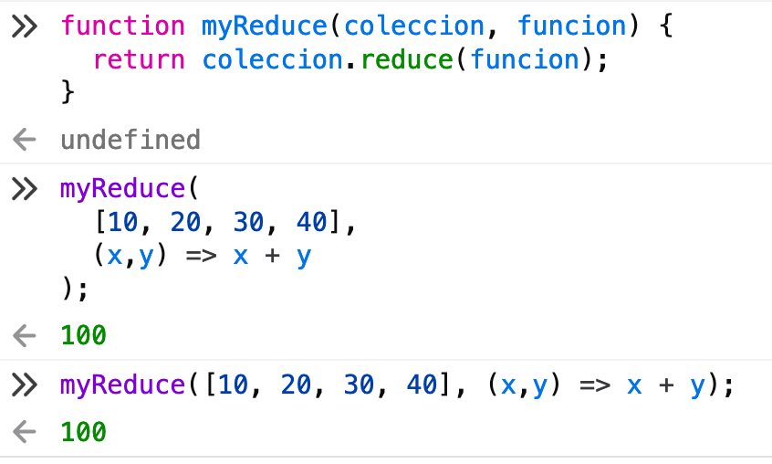

## 1.13 Notación xeral sobre tipos e funcións

Imos definir unha notación xeral para falar de tipos, funcións, parámetros e retorno.

### 1.13.1 `add1`

Consideremos a función `add1`

```js
function add1(x) {
  return x + 1;
}
```

Quedáramos en que `add1`:

- Recibe un só parámetro `x` i esperamos ademais que sexa un Número.
- Devolve un só valor `x + 1` que tamén esperamos que sexa un Número.

Poderiamos expresar toda esa información do seguinte xeito

```js
//       add1 :: Number → Number
function add1(x) {
  return x + 1;
}
```

### 1.13.2 `add`

Consideremos agora a función `add`

```js
function add(x, y) {
  return x + y;
}
```

Quedáramos en que `add`:

- Recibe 2 parámetros `x` e `y` i esperamos ambos sexan Números.
- Devolve un só valor `x + y` que tamén esperamos que sexa un Número.

Poderiamos expresar toda esa información do seguinte xeito

```js
//       add :: Number → Number → Number
function add(x, y) {
  return x + y;
}
```

### 1.13.3 `<string>.toUpperCase` e `yell`

Estas dúas funcións son mais interesantes xa que fan o mesmo pero veremos como a súa descrición non coincide. Comezamos por `<string>.toUpperCase`

```js
"Hello".toUpperCase();
```

`toUpperCase`:

- Recibe 0 parámetros `()`.
- Devolve un só valor que esperamos sexa un `String`.

Poderiamos expresar toda esa información do seguinte xeito

```js
//      toUpperCase :: () → String
"Hello".toUpperCase();
```

O mais complicado deste caso 👆 é percatarnos de que pese a que `toUpperCase` utiliza o `String` `"Hello"`, éste non é pasado como parámetro `()` polo que non computa na nosa descrición. Porén, arranxamos iso con `yell`

```js
function yell(text) {
  return text.toUpperCase()
}
```

`yell`:

- Recibe 1 parámetro `text` que esperamos sexa un `String`.
- Devolve un só valor que esperamos sexa outro `String`.

Polo tanto

```js
//       yell :: String → String
function yell(text) {
  return text.toUpperCase()
}
```

Comparemos a descrición de `<string>.toUpperCase` coa de `yell`

```js
toUpperCase :: ()     → String
       yell :: String → String
```

Pese a que fan o mesmo, a descrición é diferente.

### 1.13.4 `<string>.toLowerCase` e `chillTheFunkOut`

O mesmo caso de antes, 2 funcións que fan o mesmo e teñen descricións diferentes.

```js
//      toLowerCase :: () → String
"HELLO".toLowerCase();

//       chillTheFunkOut :: String → String
function chillTheFunkOut(text) {
  return text.toLowerCase();
}
```

Comparemos as descricións de `<string>.toUpperCase`, `yell`, `<string>.toLowerCase` e `chillTheFunkOut`

```js
    toUpperCase :: ()     → String
           yell :: String → String
    toLowerCase :: ()     → String
chillTheFunkOut :: String → String
```

### 1.13.5 `<array>.map(function)` e `myMap`

Algo parecido acontece tamén con `<array>.map(function)` e `myMap`. Fan o mesmo pero teñen descricións diferentes. Imos usar `Fn` para simbolizar `Function`.

```js
//               map :: Fn → Array Number
[10, 20, 30, 40].map(x => x + 1);

//       myMap :: Array Number → Fn → Array Number
function myMap(coleccion, funcion) {
  return coleccion.map(funcion);
}
```

Comparemos as descricións de ambas

```js
  map ::                Fn → Array Number
myMap :: Array Number → Fn → Array Number
```

### 1.13.6 `<array>.filter(predicate)` e `myFilter`

O mesmo caso que con `map` e `myMap`

```js
//               filter :: Fn → Array Number
[10, 20, 30, 40].filter(x => x > 15);

//       myFilter :: Array Number → Fn → Array Number
function myFilter(coleccion, predicado) {
  return coleccion.filter(predicado);
}
```

Recordade que un `predicate` (predicado) é unha función (o que acontece é que é unha función que retorna un booleano: `true` ou `false`).

```js
  filter ::                Fn → Array Number
myFilter :: Array Number → Fn → Array Number
```

### 1.13.7 `<array>.reduce(function)` e `myReduce`

O mesmo caso de `map` e `myMap` e de `filter` e `myFilter`

```js
//               reduce :: Fn → Number
[10, 20, 30, 40].reduce((x,y) => x + y);

//       myReduce :: Array Number → Fn → Number
function myReduce(coleccion, funcion) {
  return coleccion.reduce(funcion);
}
```

Agora as descricións comparadas

```js
  reduce ::                Fn → Number
myReduce :: Array Number → Fn → Number
```

Novamente, 2 funcións que fan o mesmo teñen descricións diferentes.

### 1.13.8 Consideracións extra

1. A descrición de funcións mediante os tipos **non consideran un efecto secundario como unha saída!**.
2. Cando usamos a notación `<algo>.funcion(...)`, `algo` non conta como entrada.

### 1.13.9 Derivando unha fórmula xenérica para `myMap`

Recordemos `myMap`

```js
function myMap(coleccion, funcion) {
  return coleccion.map(funcion);
}
```

`myMap` pode ter todas estas descricións (pode incluso ter máis)

```js
myMap :: Array Number → Fn → Array String
myMap :: Array Number → Fn → Array Number
myMap :: Array String → Fn → Array String
myMap :: Array String → Fn → Array Number
```

É certo que todavía no vimos exemplos de función coa seguinte forma ou descrición

```js
nonVista1 :: Number → String
nonVista2 :: String → Number
```

pero existen.

> _Qué é o que cambia nas descricións de `myMap`?_

`String` e `Number`

> _Podemos facer ainda máis xenérica a descrición de `myMap`?_

Sí que podemos. Do mesmo xeito que é costume usar `x` e `y` como nomes dos parametros das funcións que como `add` reciben 2 números. Recordemos 👇

```js
function add(x, y) {
  return x + y;
}
```

É costume usar `a` e `b` do mesmo xeito na descrición de funcións. É dicir 👇

```js
myMap :: Array a → Fn → Array b
```

E ao igual que `x` e `y` poden valer calquera número

```
add(3,5);
add(9,14);
```

`a` e `b` poden ser calquera tipo

```js
myMap :: Array a → Fn → Array b

// a: Number, b: Number
myMap :: Array Number → Fn → Array Number

// a: String, b: String
myMap :: Array String → Fn → Array String

// a: Number, b: String
myMap :: Array Number → Fn → Array String

// a: String, b: Number
myMap :: Array String → Fn → Array Number
```

Agora todas xuntas

```js
myMap :: Array a      → Fn → Array b
myMap :: Array Number → Fn → Array Number
myMap :: Array String → Fn → Array String
myMap :: Array Number → Fn → Array String
myMap :: Array String → Fn → Array Number
```

### 1.13.10 Cal é o tipo da función `Fn` que aparece en `myMap`?

Vexamos uns cantos exemplos de funcións que sabemos que funcionan con `map` e tamén con `myMap`

```js
//       add1 :: Number → Number
function add1(x) {
  return x + 1;
}

//       yell :: String → String
function yell(text) {
  return text.toUpperCase();
}
```

É dicir

```js
add1 :: Number → Number
yell :: String → String
```

Parece que teñen a forma

```js
xxxx :: a → a
```

Todas xuntas

```js
xxxx :: a      → a
add1 :: Number → Number
yell :: String → String
```

Porén, tamén valerían funcións que teñan a seguinte forma 👇

```js
xxx1 :: String → Number
xxx2 :: Number → String
```

A forma das funcións `Fn` que admite `map`, e polo tanto `myMap`, é

```js
mapeable :: a → b
```

## 1.14 Exemplo de tipos visto na clase: `myMap` e `String`s

### 1.14.1 Definición e uso de `myMap` e `add100`

```js
//       myMap :: Array a → Fn → Array b
function myMap(coleccion, funcionMapeable) {
  return coleccion.map(funcionMapeable);
}

//       add100 :: Number → Number
function add100(number) {
  return number + 100;
}

myMap([1,2,3,4,5], add100);

myMap([1,2,3,4,5], number => number + 100);
```

Resultado de executalo na consola do Firefox 👇

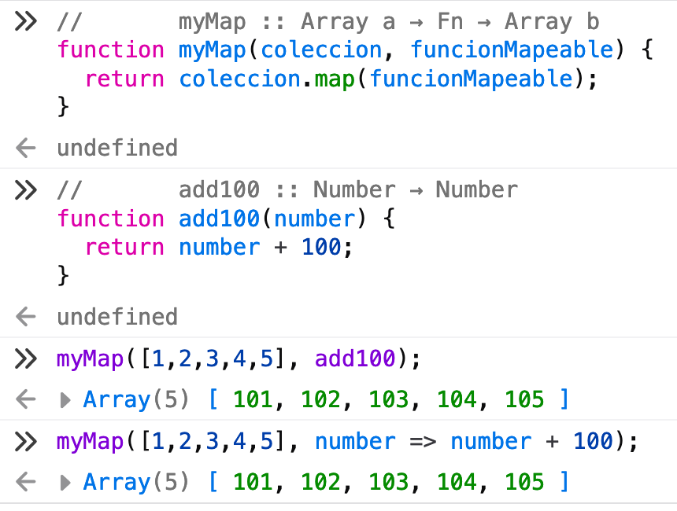

### 1.14.2 Definición e uso de `myMap` e `yell`

```js
//       myMap :: Array a → Fn → Array b
function myMap(coleccion, funcionMapeable) {
  return coleccion.map(funcionMapeable);
}

//       yell :: String → String
function yell(texto) {
  return texto.toUpperCase();  // 👈👀 recordade o return
}

myMap(["ola", "hello", "hallo", "hola"], yell);

myMap(["ola", "hello", "hallo", "hola"], texto => texto.toUpperCase());
```

Resultado de executalo na consola do Firefox 👇

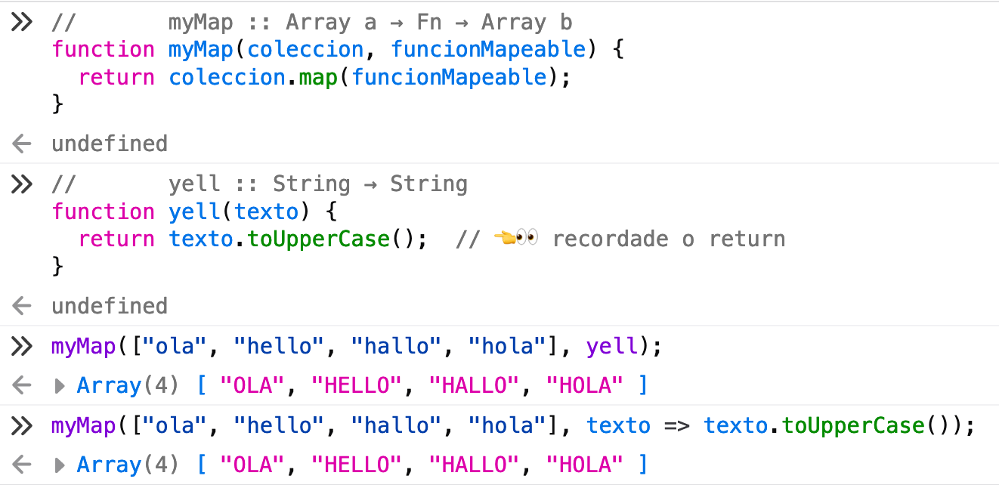

### 1.14.3 Renomeado

```js
/* 👀 supoñemos que myMap e yell están definidas de antes 👀 */

// Dámoslle o nome textos ao Array
const textos = ["ola", "hello", "hallo", "hola"];

// Podemos usar o Array ou o nome textos
textos

myMap(textos, yell);

textos.map(yell);
```

Resultado de executalo na consola do Firefox 👇

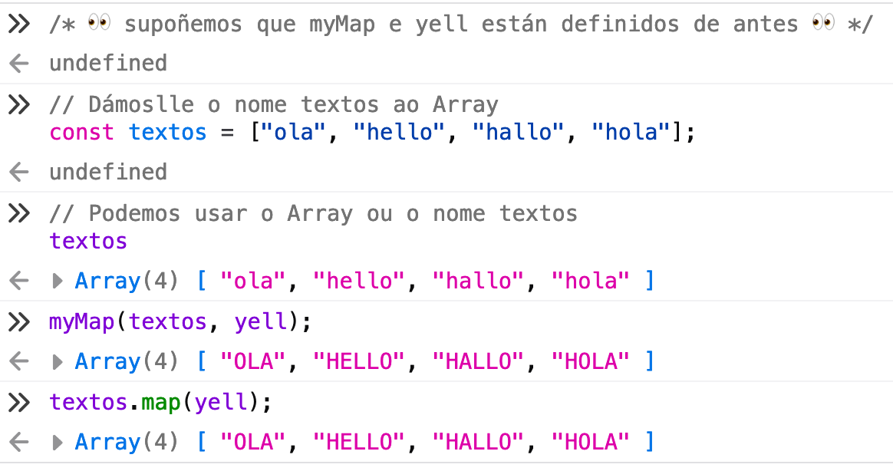

### 1.14.4 Podemos renomear 2 veces?

Imos probar o seguinte código a ver se funciona

```js
const saudos = ["ola", "hello", "hallo", "hola"];

saudos;

const saudos = ["abur", "ciao", "arrivederci", "bye"];

const despedidas = ["abur", "ciao", "arrivederci", "bye"];
```

Probamos

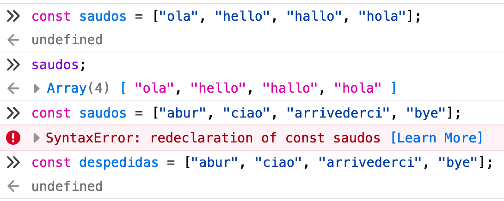

💩👎👎👎

Non podemos.

## 1.15 As 3 cousas que podemos facer coas funcións

### 1.15.1 Definilas

Xa coñecemos 2 xeitos diferentes de facelo

#### 1.15.1.1 _Function definition_, _function declaration_ ou _function statement_

O primeiro que vimos na clase 👇

```js
function add1(x) {
  return x + 1;
}
```

```js
function add(x,y) {
  return x + y;
}
```

#### 1.15.1.2 _Lambda Functions_ ou _Arrow Functions_

O que usamos as veces con `map`, `filter` e `reduce`

```js
(x,y) => x + y;
```

Recordade que as _Lambda Functions_ son **anónimas** (non levan nome).

### 1.15.2 Invocalas

Usando

```js
<nome-da-funcion>(argumentos);
```

por exemplo

```js
add1(9);   // Devolve un 10
add1(4);   // Devolve un 5
add(4,8);  // Devolve un 12
```

#### 1.15.2.1 GOTCHA - COIDADO

👀 O uso de **`(argumentos)`** é sempre indicativo de **invocación** 👀.

### 1.15.3 Usalas como valores

En JavaScript as funcións son **VALORES** (**datos**) por si mesmas. É dicir, son valores do mesmo xeito que 👇

```js
100;
true;
"Hello";
[33, 44, 55];
```

Polo feito de ser valores, podemos

1. **Renomealas** (soese usar a expresión _"asignalas a unha variable"_).
2. **Pasalas a outras funcións como argumentos** (recordade as funcións que pasamos a `map`, `filter` e `reduce`).
3. **Ser devoltas** (`return <función>`) por outras funcións.

Ata o de agora, na clase, só fixemos o **punto 2** (pasalas a outras funcións). Nunca renomeamos unha función (**punto 1**) e nunca devolvimos unha función (**punto 2**).

#### 1.15.3.1 Exemplo de renomeado

Sen entrar na utilidade que ten esto, estamos a referirnos a 👇

```js
const suma50 = (x) => x + 50;
```

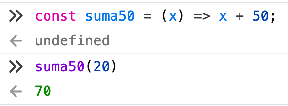

ou ben a esto 👇

```js
const suma51 = function add51(x) {
  return x + 51;
}
```

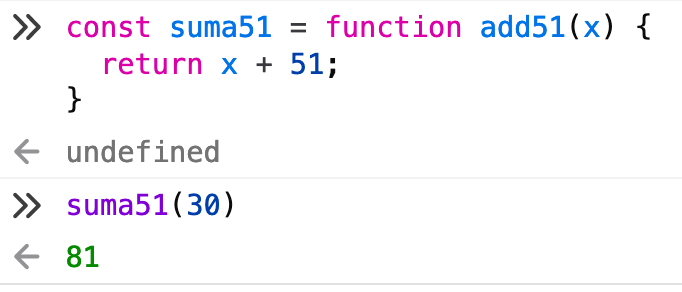

#### 1.15.3.2 Exemplo de argumentos de funcións

(**Fixémolo moitas veces na clase**)

Consideremos `add1` (supoñendo que previamente a definíramos)

```js
[3,5,7,9].map(add1);
```

👆 `add1` está a ser **usada coma un valor**, do mesmo xeito que o número `5` 👇

```js
add1(5);
```

Outro xeito de facelo (**e complicalo**) é **crear e pasar como valor ao mesmo tempo**. Tamén o fixemos, pero non o explicaramos deste xeito.

```js
[3,5,7,9].map(x => x + 1);
```

Creamos a _Lambda Function_ `x => x + 1` e inmediatemente pasámoslla a `map`.

#### 1.15.3.3 Exemplo de retornado de función

Este exemplo é para que vexades que se pode facer. Cando nos metemos a estudar as funcións podemos chegar a cousas tan enrevesadas como este exemplo. Tomádeo coma un pasatempo, un crebacabezas (ainda que realmente é moi útil).

```js
function giveMeAdd100() {
  return (x => x + 100);
}

giveMeAdd100();

giveMeAdd100()(30);  // 👈 WTF 😱😱😱!!!!!
```

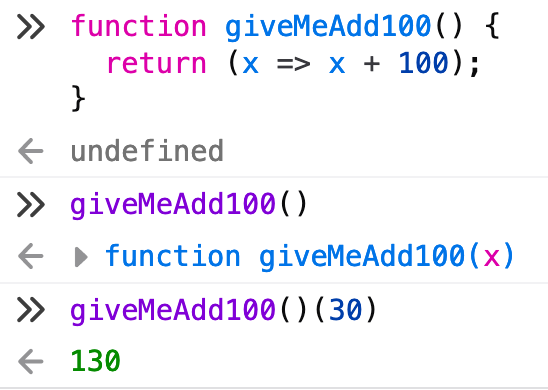

Fixádevos no doble paréntese `()(30)` 👈 🤕🤕🤕🤕🤕 (**DOR DE MIOLOS!**)

#### 1.15.3.4 GOTCHA - COIDADO

👀 Cando usamos unha función coma un valor, **NON LEVA `()`** (senón sería unha invocación, que xa vimos que é diferente). Vexamos o seguinte exemplo 👇

```js
[3,5,7,9].map(add1);
```

- ☢︎🚦✋ **`add1` é usada como valor por `map`** por iso non leva `()` (non aparece como `add1(4)`).
- ☢︎🚦✋ **`map` é invocada** e leva `()` (aparece como `map(add1)`).

## 1.16 Definir e invocar funcións inmediatamente (IIFE)

👽👽👽 **IIFE**: _Immediately Invoked Function Expression_ 👽👽👽

### 1.16.1 Exercicio 1a: ⁉️ Exemplo IIFE (1)

> ⁉️ _Qué credes que fai o seguinte código? Cal é o resultado que se vai obter?_

```js
((x,y) => x + y)(3,4);
```

**RESPOSTA 👉**: `7`

### 1.16.2 Exercicio 1b: ⁉️ Exemplo IIFE (2)

> ⁉️ _Cómo temos que modificar o código anterior para que devolva un 11?_

**👇 UNHA DAS POSIBLES RESPOSTA 👇**

```js
((x,y) => x + y)(6,5);
```

### 1.16.3 Exercicio 1c: ⁉️ Exemplo IIFE (3)

> ⁉️ _Atopade unha alternativa en 2 pasos que sexa máis lexible e declare mellor a intención do que se pretende facer._

🎁 **PISTA**: Este daquí sería o segundo paso 👇

```js
add(3,4)
```

**👇 RESPOSTA 👇**

```js
function add(x,y) {
  return x + y;
}

add(3,4)
```

## 1.17 Statements vs Expressions

### 1.17.1 Exercicio 1a: ⁉️ qué devolve (`return`) a definición dunha función?

Imos fixarnos na definición da seguinte función (**function definition**)

```js
function add(x,y) {
  return x + y;
}
```

> ⁉️ _Qué devolve a definición da función (👁👁👁 non a invocación da función que devolvería a suma 👁👁👁)?_

**👇 RESPOSTA 👇**

`undefined`

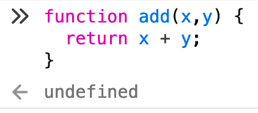

### 1.17.2 Exercicio 1b: ⁉️ qué devolve (`return`) a definición dunha Lambda?

Imos definir a mesma función pero usando unha Lambda Anónima

```js
(x,y) => x + y;
```
> ⁉️ _Qué devolve a definición da función Lambda (👁👁👁 non a invocación da función que devolvería a suma 👁👁👁)?_

**👇 RESPOSTA 👇**

**A propia función!!!** 🤪🤪🤪👽🤖👾🤪🤪🤪

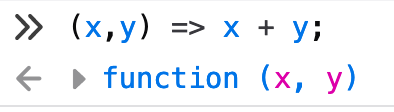

### 1.17.3 Definicións: _statement_ e _expression_

- Cando unha instrucción non devolve nada (é dicir retorna `undefined`) se dí que é un **statement**.
- Cando devolve algo (neste caso a propia función) se dí que é unha **expression**.

### 1.17.4 Exemplos: _statements_ e _expressions_

- Unha **function definition** coa palabra `function` é un **statement**.
- A definición dunha **función lambda** coa `=>` é unha **expression**.

## 1.18 `console` Object e o caso dos obxectos tramposos 🕵️‍♀️🔍

### 1.18.1 Métodos

Cando as **funcións** viven dentro dun obxecto, é usual chamalas **métodos**... Pero en realidade, simplemente son **funcións que fan _"trampas"_**...

Recordades `map` e a trampa do **array** (a colección) que non saía nas signaturas ou definicións de tipos das funcións?

```js
//               map :: Fn → Array Number
[10, 20, 30, 40].map(add1);
```

Ben. Pois **o array `[10, 20, 30, 40]`** 🥁🥁🥁🥁🥁 **é un obxecto**. E como fai trampas pode accecer aos valores do array `[10, 20, 30, 40]`.

Cando fixemos `myMap`, no fondo, a nosa intención era **desfacer as trampas** e obrigar ao array a sair nas signaturas (definicións de tipos das funcións) 👇

```js
//       myMap :: Array Number → Fn → Array Number
function myMap(coleccion, funcion) {
  return coleccion.map(funcion);
}
```

### 1.18.2 Tarefa: Inspeccionar 🔍 o obxecto `console` nas Dev Tools

**`console`** é un **obxecto** que, entre outras cousas, contén funcións.

> ⁉️ _Investigade na consola das Dev Tools o obxecto `console`._

Probade con

```js
console.log([1,2,3]);
console.info([1,2,3]);
console.error([1,2,3]);
console.name;
console.length;
```

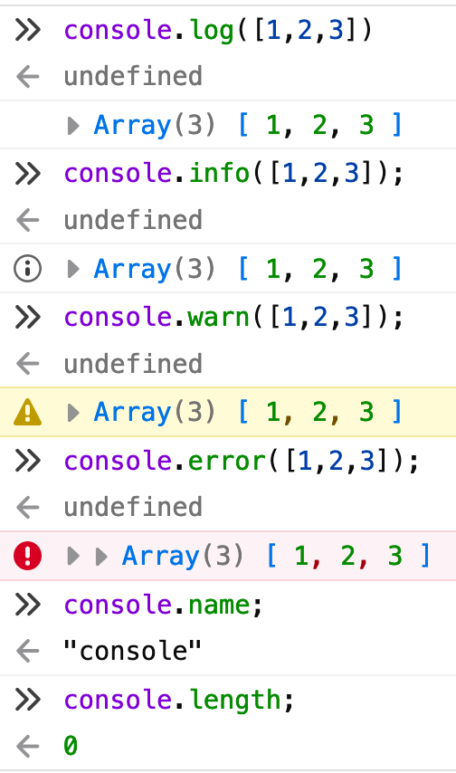


- `log` é un método (función) do obxecto `console`.
- `info` é un método (función) do obxecto `console`.
- `error` é un método (función) do obxecto `console`.

### 1.18.3 Tarefa: Inspeccionar 🔍 os `array`s coma obxectos nas Dev Tools

Na clase tamén vimos o exemplo dos arrays (que a sua vez son obxectos)

```js
[10, 20, 30, 40].map(x => x + 1);
[10, 20, 30, 40].filter(x => x >= 30);
[10, 20, 30, 40].reduce((acc,x) => acc + x);
```

`map`, `filter` e `reduce` viven **dentro** dos arrays. Por iso poden **facer _"trampas"_** e acceder a `[10, 20, 30, 40]`.

```js
[10, 20, 30, 40]
```

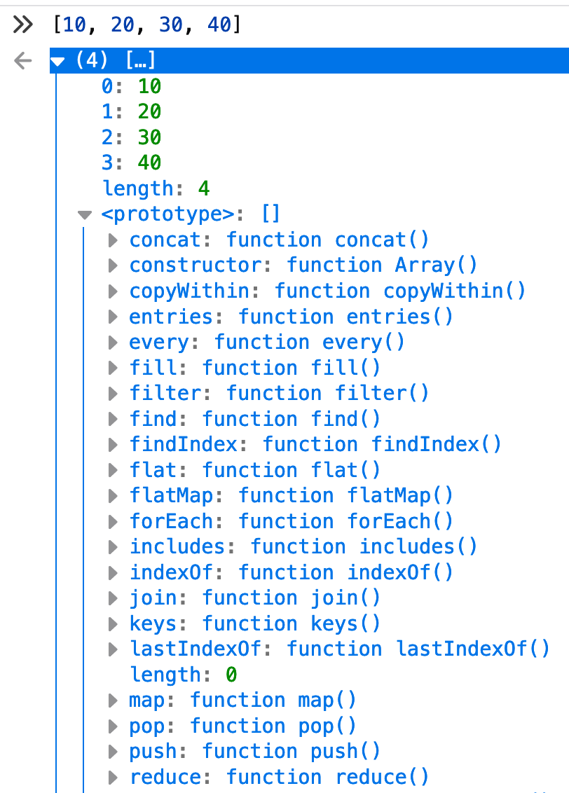

**ESQUECEDE o `<prototype>`, non o imos ver 🥳😉**.
