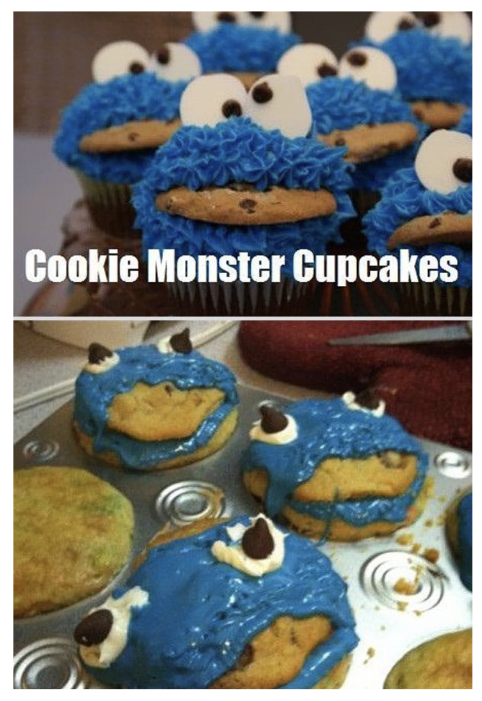
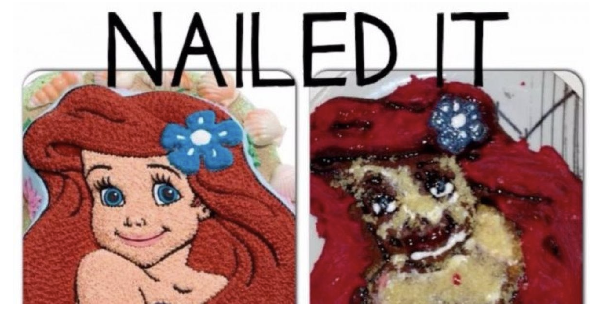

# 0 Introdución

## 0.1 Mito: hemisferio esquerdo fronte hemisferio dereito

[Right brain/left brain, right? by Robert H. Shmerling, MD, Senior Faculty Editor, Harvard Health Publishing; Editorial Advisory Board Member, Harvard Health Publishing ](https://www.health.harvard.edu/blog/right-brainleft-brain-right-2017082512222)

### 0.1.1 Por qué é relevante

Hai moita xente que se convenceu de que non ten a capacidade de facer algo creativo porque é moi de números e viceversa. **É un mito**. O cerebro **non funciona así**. É máis, hai evidencias de que **ambos hemisferios traballan en conxunto**.

### 0.1.2 Reverso ainda máis oscuro

Enorgullecerse de ser unha deseñadora horrible crendo que che fai mellor desarrolladora de software.

## 0.2 Como organizar un proxecto de deseño

En **3 cartafoles**:

- `insp`: inspiración. Todas aquelas cousas que disparan a nosa creatividade.
- `src`: source ou fonte. Aquí irán as imaxes, fontes e recursos que usemos.
- `dev`: para desenvolvemento. Xeralmente mxturado con código en JS. Soe ser un repsoitorio `git`.

## 0.3 A perfección como problema

**"Art and Fear: Observations on the Perils (and Rewards) of Artmaking"** por David Bayles, Ted Orland

>_"O profesor de cerámica anunciou o día da inauguración que **dividía a clase en 2 grupos**. Todos os que estean no lado esquerdo do estudo, dixo, serán avaliados unicamente pola **cantidade** de traballo que produzan, todos aqueles que estean no dereito, unicamente pola súa **calidade**._
>
> _O seu procedemento era sinxelo: o último día de clase levaría a súa báscula de baño e pesaría o traballo do **grupo "cantidade"**: vintecinco kilos de vasillas dábanche un "10", vinte kilos un "8", etc. Doutra banda, aqueles que se calificaban pola **"calidade"**, precisaban producir só unha vasilla, mais unha vasilla perfecta, para obter un "10"._
>
> _Chegou o **momento da avaliación** e xurdiu un dato curioso: os **traballos de máxima calidade** foron todos elaborados polo **grupo** que se avaliaba pola **cantidade**. Parece que mentres o **grupo da "cantidade"** estaba ocupado producindo pilas de traballo -e aprendendo dos seus erros-, o **grupo da "calidade"** estaba sentado a teorizar sobre a perfección e, ao final, tiña pouco máis que mostrar polos seus esforzos que teorías grandiosas e unha morea de barro sen forma."_

