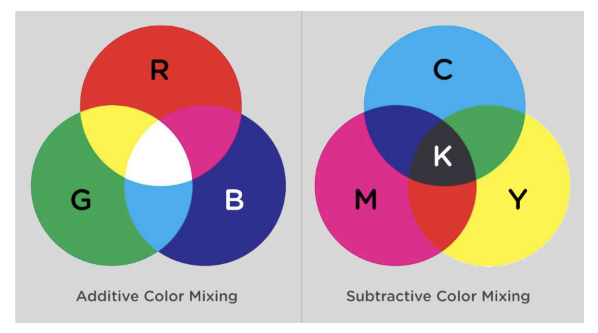
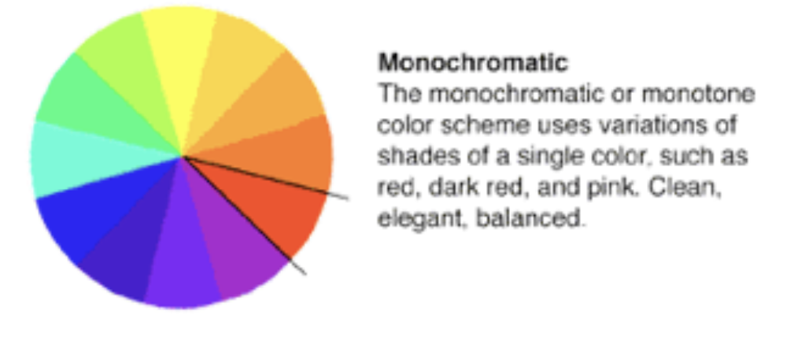
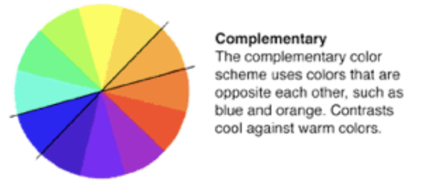
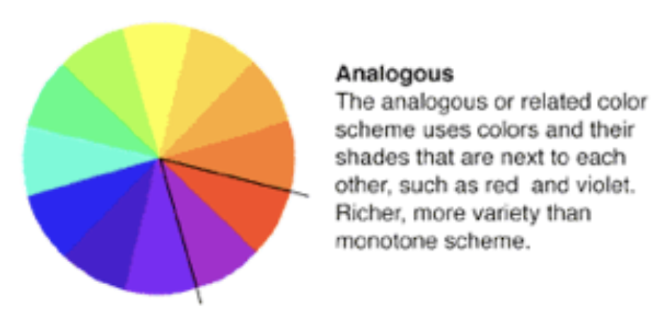
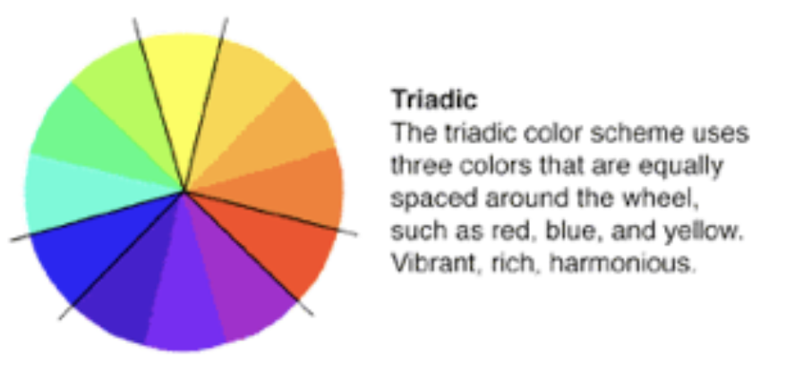
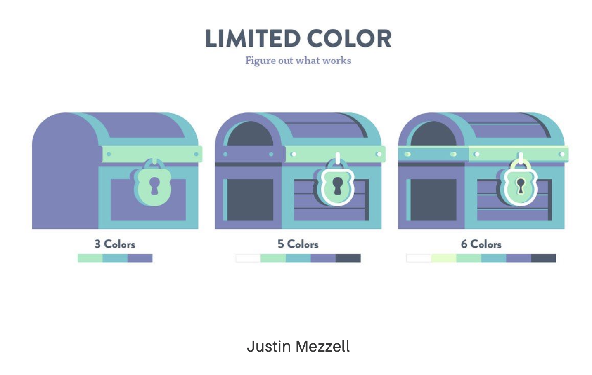

# 2 Teoría da cor

## 2.1 Modos e mixturado de cores

- **Mixturado de cores substrativo (CMYK)**: cian, maxenta, amarelo (e máis o negro (K)). Moi utilizado en imprenta.
- **Mixturado de cores adivitivo (RGB)**: vermello, verde e azul (a suma dos tres é o branco). Se traballas cunha computadora, traballas en aditivo.



O carácter aditivo ou substrativo refírese á luz (que se engade ou se substrae).

**Mito**: ❌ Vermello, amarelo e azúl son as cores primarias ❌.

## 2.2 Tipos de combinacións da cor

**IMPORTANTE**: consultade a fonte 👇🏿👇🏿👇🏿

🚀👽👾 [Fonte: Color Theory for Designers, Part 3: How To Create Your Own Color Schemes por Cameron Chapman](https://www.smashingmagazine.com/2010/02/color-theory-for-designer-part-3-creating-your-own-color-palettes/) 👾👽🚀

### 2.2.1 Monocromático

- Válese de lixeiras variacións dunha cor.



### 2.2.2 Complementario

- Cores opostas (están o máis afastadas posible).



### 2.2.3 Análogo

- Cores que comparten fronteira (que están pegadas).



### 2.2.4 Triádico

- Conxuntos de 3 cores equiespaciados.



## 2.3 Características da cor

### 2.3.1 Relatividade na cor

Podemos falar dunha **certa relatividade na cor**, xa que a cor é só unha cor en relación a outra cor.

Este aparente trabalinguas queda claro co [exemplo de Akiyoshi Kitaoka](https://twitter.com/AkiyoshiKitaoka/status/1028473566193315841)

### 2.3.2 Contraste de cor

Marca a diferencia entre as diferentes cores. É un concepto de **importancia maiúscula en `a11y`** (accesibilidade).

Podemos atopar varias ferramentas que nos axudan a probar a contraste como:

- [Colorable](https://jxnblk.com/colorable/demos/text/)
- [Accessible colors](https://accessible-colors.com/)
- [Text on background image a11y check](http://www.brandwood.com/a11y/)
- [Adobe Color](https://color.adobe.com/)

## 2.4 A cor en código

Podes xogar online coas cores en [HSLPicker de Brandon Mathis](https://hslpicker.com/)

### 2.4.1 RGB(A)

```js
rgb(x, x, x);
rgba(x, x, x, y)
```

onde:

- `x` é un número de `0` a `255`.
- `y` é un número de `0.0` a `1.0`.

Por exemplo:

- `255`, `255`, `255` é branco.
- `0`, `0`, `0` é negro.
- `x`, `x`, `x` son os grises (enténdese o mesmo valor de `x`).

### 2.4.2 `Hex`adecimal

```
#XXXXXX
```

onde `X` pode tomar valores hexadecimais (`0`-`9` e `A`-`F`).

Por exemplo:

- `#FFFFFF` é branco.
- `#000000` é negro.


### 2.4.3 HSL(A)

Representa:

- **H**ue (a roda da cor).
- **S**aturation.
- **L**ightness.
- **A**lpha.

```js
hsl(x, y, y);
hsla(x, y, y, z);
```

onde:

- `x` é un número de `0` a `360`.
- `y` é unha porcentaxe de `0%` a `100%`.
- `z` é un número de `0.0` a `1.0`.


## 2.5 Variables de cor

Podemos usar **variables de cor** en `CSS`. Debemos definir as variables de cor nun so sitio e logo usalas sempre.

```css
:root {
    --corCorporativa: purple;
}

body {
    background: var(--corCorporativa);
}
```

## 2.6 Pro-tip: limitar as cores que usamos



Inicialmente limita todo o posible a cantidade de cores que uses en calquera deseño. Co tempo, cando gañes coñecemento e experiencia podes refinar ese deseño con máis cores, acadando un nivel de detalle maior.

## 2.7 Ferramentas para traballar coa cor

Ver directamente no [pdf de Sarah Drasner](https://github.com/sdras/design-for-developers/blob/master/slides-pdf/Des4Dev3.pdf).
