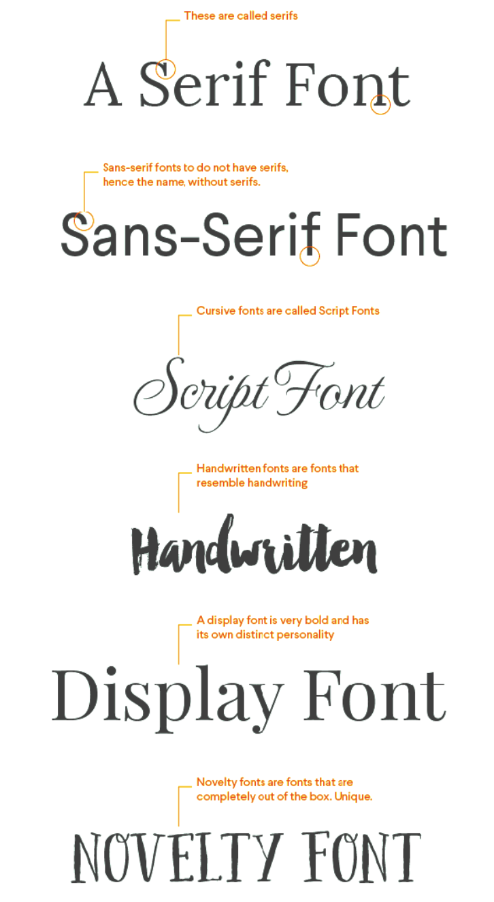
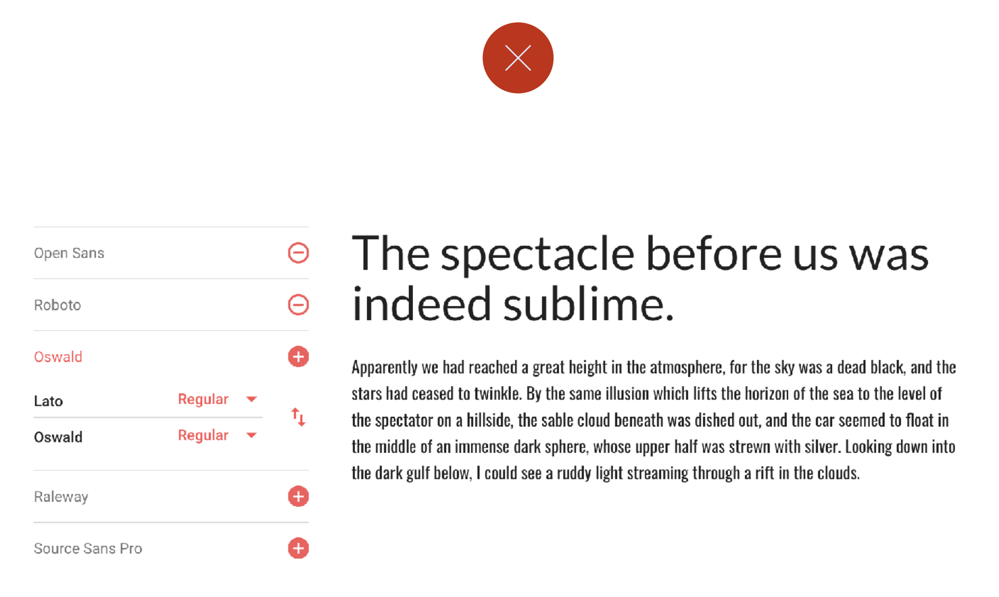
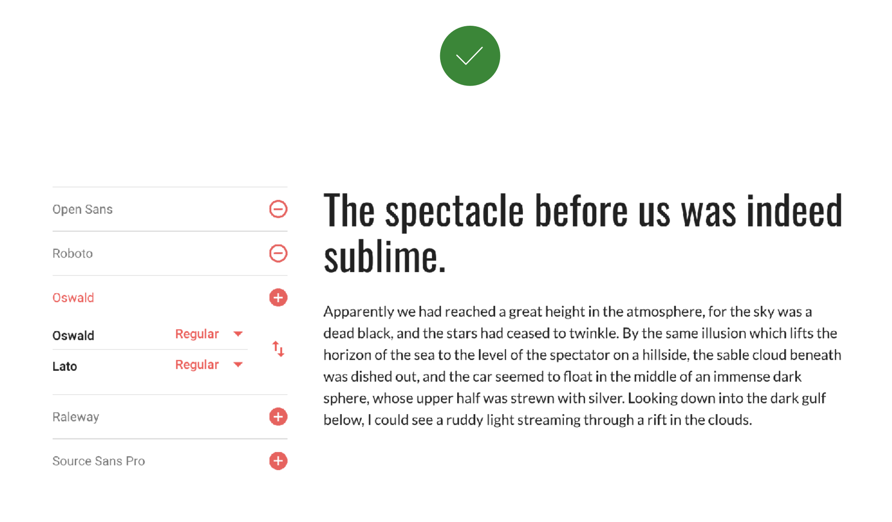
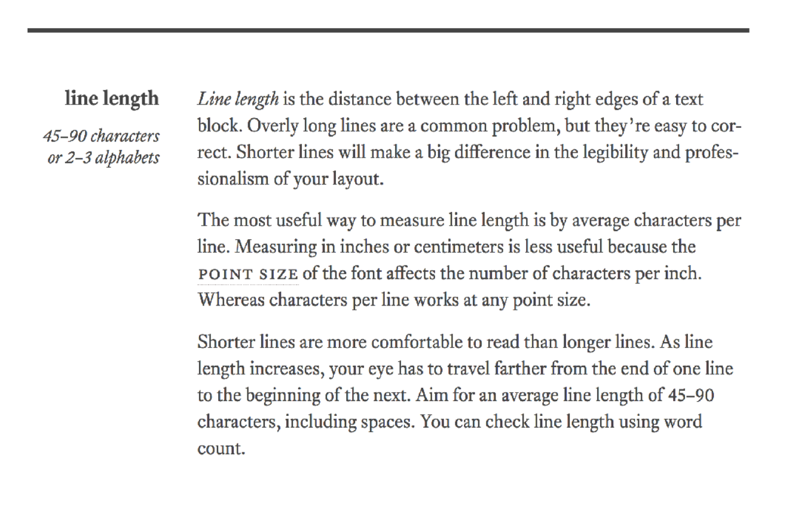
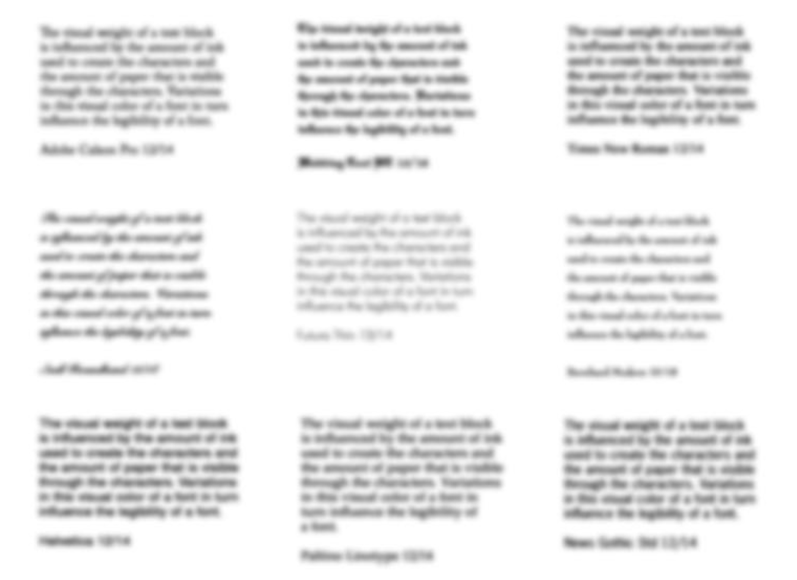
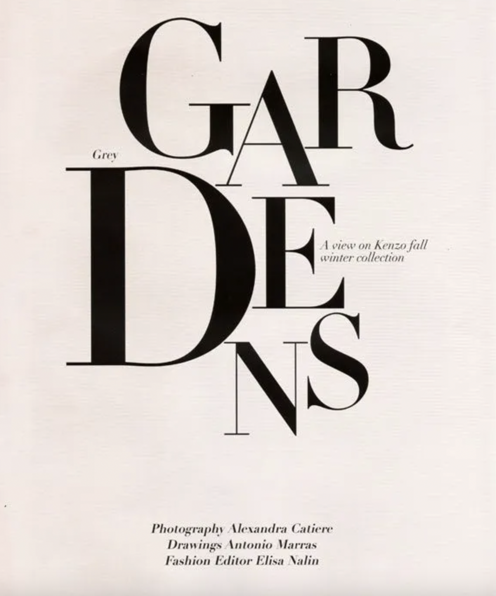
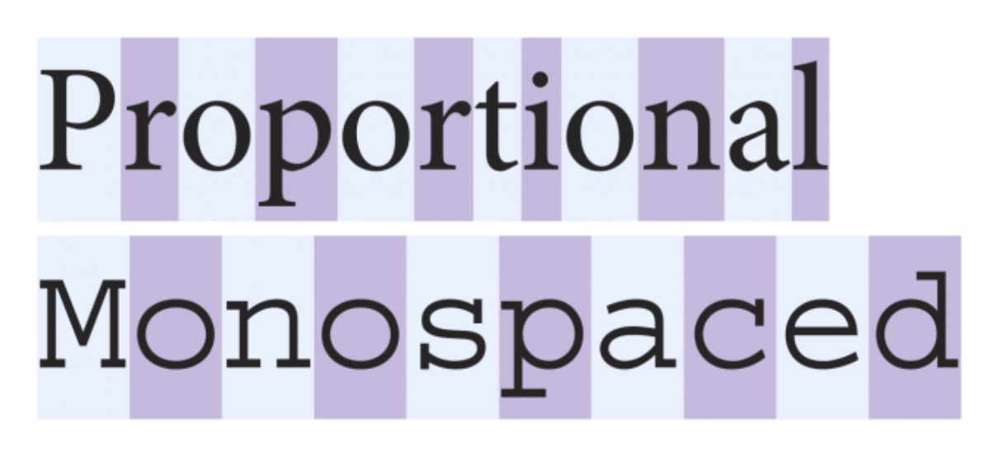
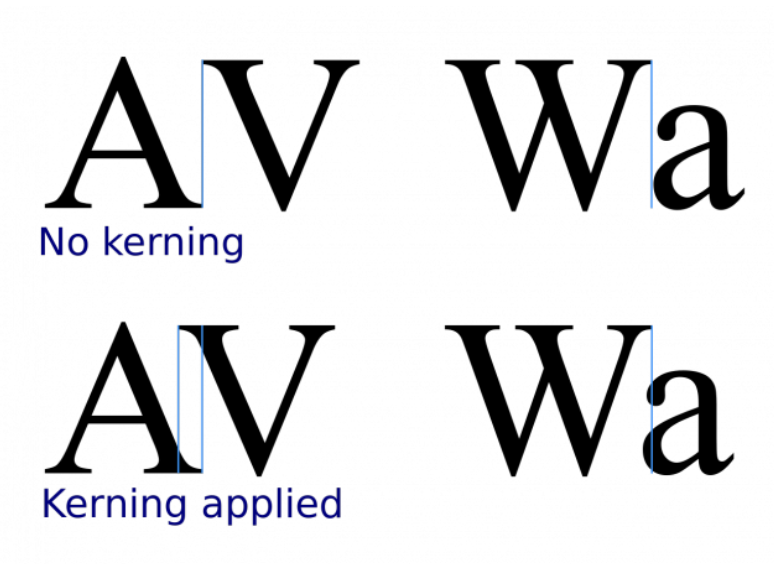
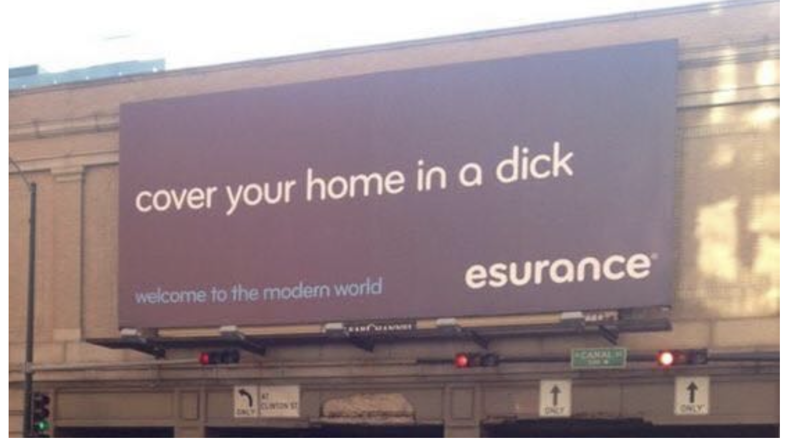
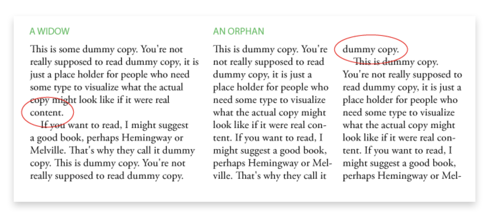

# 3 Tipografía

## 3.1 Tipos de fontes

### 3.1.1 "...to serif, or not to serif: that is the question"

> _"O chamado **serif** é un trazo decorativo que remata o final dos "pés" das letras. Cando falamos de **sans serif**, queremos dicir que estes serifs non aparecen"_

### 3.1.2 Serif

Contén serifs (ver apartado _"...to serif, or not to serif: that is the question"_).

### 3.1.3 Sans-serif

Non contén serifs. Como coas serif, mellor ver apartado _"...to serif, or not to serif: that is the question"_.

### 3.1.4 Script

Fontes en cursiva.

### 3.1.5 Handwritten

Imitan a escritura manual.

### 3.1.6 Display

Pode ser sans ou serif. En calqueira dos casos debe ser unha fonte que:

- Cando se usa a tamaños pequenos (por exemplo dentro dun `
`) pode non ser moi lexible.
- Cando se usa a tamaños grandes (por exemplo nun `<h1>`) é perfecta (lexible e con presencia).

### 3.1.7 Novelty

Son doadas de identificar; moitas parecen sacada dunha novela romántica do século XIX. Calquera fonte que destaque por extraña e peculiar, probablemente poida considerarse _novelty_.

## 3.2 Onde conseguir/mercar fontes

- [Google Fonts](https://fonts.google.com/)
- [Font Squirrel](https://www.fontsquirrel.com/)
- [Fonts.com](https://www.fonts.com/)
- [Hoefler & Co](https://www.typography.com/): preparade os 💰💵💶💷💳.

## 3.3 Emparellando fontes

### 3.3.1 Cantas fontes

Un consello interesante é _non usar unha soa fonte pero non máis de tres_ nun deseño web. Se podes, usa 2 que contrasten pero que se complementen, por exemplo unha serif e unha sans-serif.

### 3.3.2 Fontes e web

Hai un **par de problemas** coas fontes na web:

- Cargan o sistema (hai quen di que ao mesmo nivel que a carga de scripts).
- Máis de tres fontes favorecen a falta de coherencia, a sensación de _"non-deseño"_.

### 3.3.3 Pro-tip

Google Fonts ten unha ferramenta que permite emparellar fontes e ver o resultado.

### 3.3.4 Emparellado práctico

Ainda que pareza contra-intuitivo unha mesma parella de fontes pode emparellar ben e mal ao mesmo tempo 😂😂😂, depende de para que.

Por exemplo, as dúas capturas seguintes emparellan as mesmas fontes (Lato e Oswald), pero según o seu uso funcionan o non.

A parella Lato-Oswald non parece que funcione ⚠️❌⚠️

Pero a parella Oswald-Lato si parece que funciona ✅✅✅

### 3.3.5 Emparellado práctico para vagos 😆😅

A web [Fontjoy](https://fontjoy.com/) automatiza a tarefa de emparellado de fontes 🤓😃👽.

### 3.3.6 Posibles parellas

Algunhas posibles parellas:

- Unha **display** cunha **sans-serif**.
- Unha **serif** cunha **sans-serif**.

## 3.4 O libro "Typography for Lawyers"

[Typography for Lawyers 2nd edition de Matthew Butterick](https://typographyforlawyers.com/) está considerado como un dos libros clásicos sobre o tema e pese a ter certo tempo, o seu contido é relevante na actualidade.

Por poñer un exemplo, trata temas como:

1. A diverxencia na **capacide de atención** entre o que escribe (neste caso o que diseña) e o que le (no noso caso o que consulta unha web).
2. O impacto da **lonxitude de liña** nun texto, e como afecta á fatiga visual e cognitiva (recomenda entre 45 e 90 caracteres por liña).

## 3.5 Conceptos tipográficos interesantes

### 3.5.1 Cor tipográfica

> _Refírese "á sombra xeral de gris percibida polo ollo, que pode verse interrompida por quebras erróneas de palabras, espazamento de caracteres inconsistente ou interlineado irregular. A cor tipográfica só se pode determinar revisando o tipo despois da configuración."_

Cita sacada de [PrintWiki](http://printwiki.org/Typographic_Color)

### 3.5.2 _Fluid typography_ ou **tipografía fluida**

> _"A diferenza da tipografía responsiva (_responsive_), que cambia só nos puntos de interrupción establecidos, a tipografía fluída redimensiona suavemente para que coincida con calquera ancho do dispositivo. É unha opción intuitiva para unha web na que temos un número practicamente infinito de tamaños de pantalla que soportar."_

A cita é de [Michael Riethmuller](https://www.madebymike.com.au/) que ten 2 artigos moi interesantes sobre o tema:

- [Responsive and Fluid Typography with `vh` and `vw` Units](https://www.smashingmagazine.com/2016/05/fluid-typography/)
- [Fluid typography examples](https://www.madebymike.com.au/writing/fluid-type-calc-examples/)

### 3.5.3 _Text lockup_ ou **bloqueo de texto**

> _"Un bloqueo de tipos é un deseño tipográfico onde as palabras e os caracteres teñen un estilo e están dispostos de forma moi específica. Como se o deseño estivese literalmente bloqueado nunha posición."_

Cita de Geoff Graham. Tanto el coma Chris Coyier (creador de [CSS Tricks](https://css-tricks.com/) e co-creador do [codepen.io](https://codepen.io/) contan con sendos artigos seminais sobre o tema:

- [Creating a Web Type Lockup de Chris Coyier en CSS Tricks](https://css-tricks.com/creating-web-type-lockup/)
- [Text Lock-Up en CSS-Tricks de de Geoff Graham, tamén en CSS Tricks](https://css-tricks.com/snippets/svg/text-lock-up/)

## 3.6 Terminoloxía

### 3.6.1 Fontes monoespaciadas fronte a fontes propocionais

- **Fontes _monospaced_ ou monoespaciadas**: cada letra ocupa o mesmo espazo.
- **Fontes proporcionais**: o espacio que ocupa cada letra é proporcional ao seu tamaño (non é monoespaciada).

### 3.6.2 Kerning

O **kerning** (non atopei unha tradución ao galego) é o espazo existente entre dúas letras consecutivas (`letter-spacing` en termos CSS).

Un **exemplo dramático de _kerning_ erróneo** 🤦‍♀️🤦‍♀️ que adquiriu categoría de meme 👇🏿👇🏿

Explicar o malentendido anula a sua gracia... pero ainda así: _dick_ ou _click_?

### 3.6.3 _Leading_ ou interlineado

O **_leading_ ou interlineado** é a distancia entre as liñas de texto. Do mesmo xeito que o tamaño da fonte, esta distancia mídese en diferentes unidades, aínda que os puntos (`pt`), porcentaxes e `em` son as unidades máis comúns. (`line-height` en termos CSS)

A **orixe do termo** remóntase ao século XVIII cando nas imprentas, para separar as liñas de texto entre si (o texto era de chumbo, por certo) usábanse tiras de chumbo (_lead_). Se querías máis separación precisabas tiras de chumbo extra. Daí o termo e a súa curiosa pronuncia en inglés ('ledding', non 'leeding').

### 3.6.4 _Widows_ e orfos

**NOTA**: widows (_viúvas_) é o termo que se utiliza tradicionalmente, por eso o recollo. Se non atopades un termo mellor e incomódavos as **evidentes connotacións machistas**, probade a usar o masculino _viúvos_. Nestes apuntamentos recollerei o termo en inglés (_widow_) que, para as galegofalantes (ou castelánparlantes), ten algo menos de connotación negativa pola barreira idiomática e ainda así permite ser buscado na web en caso de necesidade.

- **widow**: unha palabra sóa ao final dun parágrafo en liña propia e sen salto de bloque.
- **orfo**: unha liña sóa ao final dun parágrafo e con salto de bloque.

Ambos termos refírense a características **non desexadas** nun texto.

### 3.6.5 Ligaduras

Unha **ligadura** acontece cando dous ou maís grafemas ou letras únense (_líganse_, daí o termo) para converterse nun so glifo.

Hai quen aprecia maior lexibilidade con ligaduras, hai quen aprecia o contrario.

Dende vai uns anos está moi de moda utilizar fontes con ligaduras en programación. [FiraCode](https://github.com/tonsky/FiraCode) é unha fonte gratuita moi famosa e utilizada por moitas programadoras. A seguinte táboa (sacada da súa web) ilustra perfectamente o concepto

### 3.6.6 Terminoloxía extra

A terminoloxía asociada á tipografía é moi extensa. Dende [Free Typography Basics Cheatsheet: Anatomy, Classification & Special Terms](https://creativemarket.com/blog/typography-terms-cheatsheet) podedes descargar un cheatsheet en pdf.

## 3.7 Fontes, web e rendemento

É un tema moi relevante pero de gran complexidade. Recoméndovos:

- A charla [The Five Whys of Web Font Loading Performance](https://www.zachleat.com/web/five-whys/) de Zach Leatherman.
- O repo de Github [SubFont](https://github.com/Munter/subfont) de Peter Müller.
