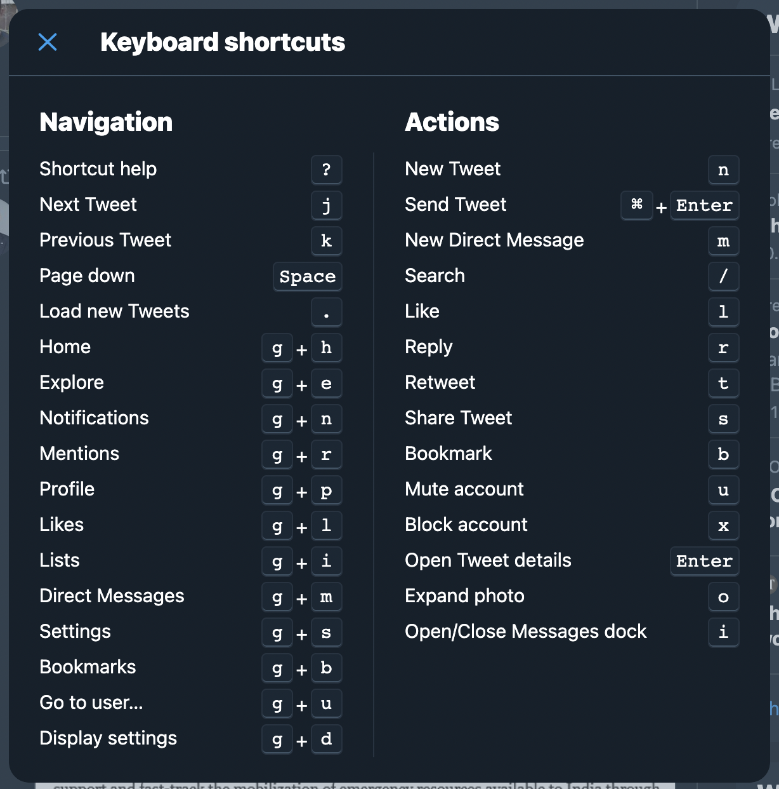
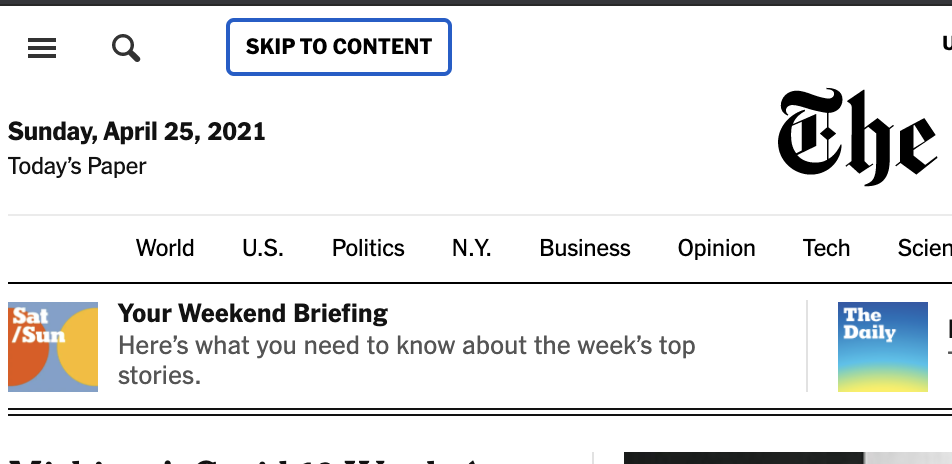

# 4 Xestión do foco

## 4.1 Usuarias que navegan usando exclusivamente o teclado

### 4.1.1 Aneis de foco

Mentres unha usuaria navega usando o teclado, os aneis de foco proporcionan unha pista necesaria sobre o elemento activo actualmente.

Se nos atopamos enriba dunha ligazón ten que existir algún tipo de pista visual que así o indique.

### 4.1.2 Guideline 3.2 de WebAIM

Consulta a lista de [WebAIM (ver Guideline 3.2)](https://webaim.org/standards/wcag/checklist).

## 4.2 Atallos de teclado

Os **atallos de teclado** son un exemplo de aplanamento da pendente de aprendizaxe.

Sitios como Twitter e Facebook ofrecen atallos de teclado para case calquera acción e que funcionan moi ben tanto para usuarias de teclado como para usuarias avanzadas.



## 4.3 Saltar ligazóns

### 4.3.1 En que consiste?

Omitir ou saltar ligazóns axuda ás usuarias a **evitar grandes cabeceiras de navegación** e ir directamente ao **contido _"principal"_** dun sitio.

Cando unha usuaria preme o `TAB`ulador na lapela por primeira vez, aparecerá un botón que facilitará o salto á sección principal.



### 4.3.2 Guideline 2.4 de WebAIM

Consulta a lista de [WebAIM (ver Guideline 2.4)](https://webaim.org/standards/wcag/checklist).

### 4.3.3 Como saltar ligazóns a vista de paxaro

1. Crea un `<a>` coa mensaxe _"🏌️‍♀️ Saltar ao contido 🏌️‍♀️"_ e con `href` ao contido principal.
2. Antepono ao `<body>` do teu sitio web.
3. Faino visualmente oculto (por exemplo mediante a clase CSS `.visuallyhidden` que vimos anteriormente).
4. Faino visible mediante o estado de enfoque cando se `TAB`ule na páxina (novamente, usando CSS).

### 4.3.4 Por qué funciona?

- Un `<a>` é `TAB`ulable por defecto.
- _"🏌️‍♀️ Saltar ao contido 🏌️‍♀️"_ é invisible (clase CSS `.visuallyhidden`) inicialmente.
- Ao `TAB`ular ao inicio da páxina _"🏌️‍♀️ Saltar ao contido 🏌️‍♀️"_ pasa a ser visible.

### 4.3.5 Como saltar ligazóns #ShowMeTheCodeEdition

> _**(1)** Crea un `<a>` coa mensaxe "🏌️‍♀️ Saltar ao contido 🏌️‍♀️" e con `href` ao contido principal._

```html
<a href="#obxectivo" id="salta">🏌️‍♀️ Saltar ao contido 🏌️‍♀️</a>
```

> _**(2)** Antepono ao `<body>` do teu sitio web._

```html
<body>
    <a href="#obxectivo" id="salta">🏌️‍♀️ Saltar ao contido 🏌️‍♀️</a>
    <header>
        <nav>
            <!-- AQUÍ VAI o MENÚ QUE QUEREMOS SALTAR -->
        </nav>
    </header>
    <section>
      <h1>Contido principal</h1>
      <p>
        I'm baby everyday carry farm-to-table
        normcore grailed cold-pressed trust fund
        tousled, vinyl portland gastropub shabby
        chic ugh franzen dreamcatcher fingerstache.
        90's locavore YOLO, gorpcore tilde glossier
        cliche. Tacos.
      </p>

      <button id="obxectivo">🚀 Salta ata aquí 🚀</button>
    </div>
```

> _**(3)** Faino visualmente oculto mediante CSS._

```css
#salta {
    background: #e77e23;
    height: 30px;
    left: 50%;
    padding: 8px;
    position: absolute;
    transform: translateY(-100%);
    transition: transform 0.3s;
}
```

> _**(4)** Faino visible mediante o estado de enfoque cando se `TAB`ule na páxina (novamente, usando CSS)._

```css
#salta:focus {
    transform: translateY(0%);
}
```

## 4.5 Navegación mediante `TAB`ulado

## 4.5.1 En que consiste?

A idea é moi simple e consiste en:

- Usar a tecla de **`TAB`**ulado para navegar ata o **seguinte elemento** `TAB`ulable.
- Usar a combianción de teclas **⇧ + `TAB`** para navegar ao **elemento anterior**.

### 4.5.2 Guideline 2.1 de WebAIM

Consulta a lista de [WebAIM (ver Guideline 2.1)](https://webaim.org/standards/wcag/checklist).

### 4.5.3 Elementos `TAB`ulables

Entre outros:

- [`<a>`](https://developer.mozilla.org/en-US/docs/Web/HTML/Element/a)
- [`<button>`](https://developer.mozilla.org/en-US/docs/Web/HTML/Element/button)
- [`<input>`](https://developer.mozilla.org/en-US/docs/Web/HTML/Element/input)
- [`<select>`](https://developer.mozilla.org/en-US/docs/Web/HTML/Element/select)
- [`<textarea>`](https://developer.mozilla.org/en-US/docs/Web/HTML/Element/textarea)
- [`<iframe>`](https://developer.mozilla.org/en-US/docs/Web/HTML/Element/iframe)

Os máis usados probablemente sexan: `<input>`, `<button>`e `<a>`.

### 4.5.4 Facendo un elemento `TAB`ulable con `tabindex`

Podemos engadir o atributo [`tabindex`](https://developer.mozilla.org/es/docs/Web/HTML/Global_attributes/tabindex) a calquera elemento non `TAB`ulable como por exemplo un `<div>`

```html
<div tabindex="0">Agora son 🦄🦄🦄 enfocable 🥳</div>
```

### 4.5.5 Valores posibles de `tabindex`

- Un **valor negativo** significa que o elemento debe ser enfocable, pero non debe ser accesible mediante a navegación secuencial do teclado.
- **`0`** significa que o elemento debe ser enfocable e accesible mediante a navegación secuencial do teclado, pero a súa orde relativa está definida pola convención da plataforma.
- Un **valor positivo** significa que debe ser enfocable e accesible mediante a navegación secuencial do teclado; a súa orde relativa está definida polo valor do atributo (número crecente do índice de tabulacións). Se varios elementos comparten o mesmo índice de tabulacións, a súa orde relativa segue a súa posición relativa no documento.

## 4.6 Elemento activo: `document.activeElement` (⚠️ JS Alert! ⚠️)

Ás veces, especialmente nas SPA (Single Page Application), é útil almacenar o **elemento activo** (o que ten o foco) antes dunha transición de páxina para poder volver a el máis tarde.

```js
// ⚠️ Vaise abrir un modal ⚠️

// Almacena o elemento activo
const currentItem = document.activeElement;

// Ábrese o modal

// ⚠️ Péchase o modal ⚠️

// Retoma o foco no elemento activo anterior
currentItem.focus()
```

## 4.7 Trampa de `TAB`ulación AKA _Tab trapping_ (técnica JS)

Supoñamos que abrimos un modal nunha páxina que conteña un formulario. Nese caso, unha usuaria que navegue co teclado quererá tabulación ao redor do formulario, pero por defecto se `TAB`ulamos no último elemento do formulario voltaremos ao documento principal (comportamento non desexado). A trampa de `TAB`ulación soluciona este problema. Para implementala:

> _precisamos determinar tanto **o primeiro coma o último elemento `TAB`ulable** dentro do modal para **intervir** e **saltar dun ao outro de xeito circular** evitando a perder do foco._

Esta técnica **é puramente unha técnica JS**, por iso non se detalla.
