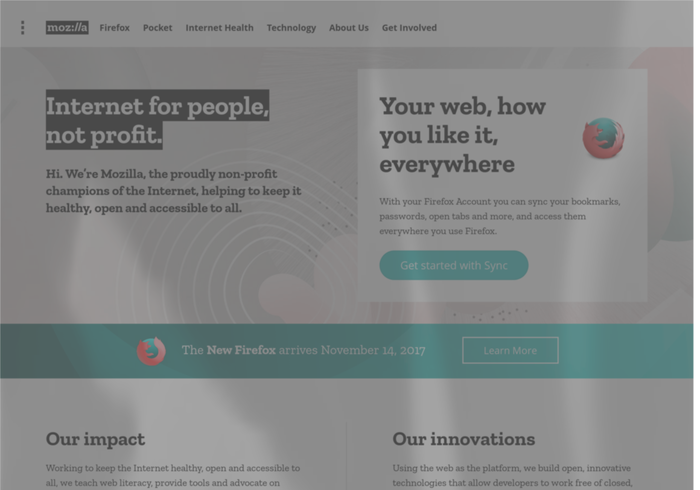

# 5 Consideracións visuais

## 5.1 Contraste da cor

### 5.1.1 Utiliza ferramentas especializadas

Debido á variedade de problemas visuais que poden ter as usuarias dun sitio web, é moi complicado establecer a simple vista que cores contrastan o suficiente dende unha óptica `a11y`.

A mellor aproximación é utilizar ferramentas especializadas como o [comprobador de contraste de WebAIM](https://webaim.org/resources/contrastchecker/), que proporciona información sobre o contraste (_contrast ratio_) e especifica se pasa algunhas validacións WCAG.

### 5.1.2 O patrón anel vermello / anel verde

Unha consideración importante para as **usuarias daltónicas** é asegurarse de que **a cor non é a única forma** en que poden saber **se hai un erro nun formulario**. Por exemplo, o patrón habitual

> _un anel vermello se algo foi mal e un anel verde se todo foi ben **non é suficiente**._

Considera engadir unha icona equivalente para sinalar que algo foi mal ❌, e outra para sinalar que foi ben ✅ ou unha etiqueta de erro.

### 5.1.3 Guideline 1.4 de WebAIM

Consulta a lista de [WebAIM (ver Guideline 1.4)](https://webaim.org/standards/wcag/checklist).

## 5.2 Deficiencias visuais

### 5.2.1 Simulación

Para **simular** unha serie de **deficiencias visuais** en calquera sitio web, pódese utilizar a [extensión NoCoffee para Firefox](https://addons.mozilla.org/en-US/firefox/addon/nocoffee/)



### 5.2.2 Graos de deficiencia visual

É importante entender que a xente que utiliza un sitio web non se pode clasificar simplemente entre xente con visión perfecta e xente sen visión; hai unha **chea de casuísticas intermedias** e **diferentes graos nas deficiencias visuais**.

### 5.2.3 Erros e notificacións

Os **erros e notificacións** que proporcionan información do que estás a facer nun instante concreto nunha páxina **deberían estar o máis preto posible da fonte do erro**.

Este patrón de deseño axuda enormemente ás usuarias con visión limitada ou con outras enfermidades relacionadas coa mala visión periférica (que se pode traducir na incapacidade para ver os bordes con nitidez, por exemplo).

## 5.3 Axuste do idioma

### 5.3.1 O atributo `lang`

Lembra establecer o atributo `lang` tanto na etiqueta `html` de nivel superior como nas seccións onde o idioma varíe.

### 5.3.2 Guideline 3.1 de WebAIM

Consulta a lista de [WebAIM (ver Guideline 3.1)](https://webaim.org/standards/wcag/checklist).

### 5.3.3 `i18n`

Esta sección **abre a porta** a todo o tema da **internacionalización ou `i18n`**, que se escapa dos obxectivos deste módulo.

## 5.4 Consistencia do `html`

> _"O contido ten que ser suficentemente robusto para poder ser interpretado correctamente por unha gran variedade de axentes de usuario, incluíndo tecnoloxías de asistencia."_

Consulta a lista de [WebAIM (ver Guideline 4.1)](https://webaim.org/standards/wcag/checklist).

## 5.5 Neurocognición

### 5.5.1 Preferencia _"reducir movemento"_

#### 5.5.1.1 No sistema operativo

As usuarias poden establecer na configuración do seu SO a opción de **_"reducir movemento"_**. Esta opción pode ser lida e considerada no CSS, permitindo intercambiar animacións por efectos máis sutís.

Respetar esta configuración é importante para evitar causar problemas ás usuarias que poidan sufrir convulsións.

#### 5.5.1.2 En código

```html
<div class="animation">animated box</div>
```

```css
.animation {
    animation: pulse 1s linear infinite both;
}

@media (prefers-reduced-motion) {
    .animation {
        animation-name: dissolve;
    }
}
```

O resultado 🤓😎👇🏿


#### 5.5.1.3 Guideline 2.3 de WebAIM

> _"Non deseñe contido dun xeito que poida provocar convulsións."_

Consultar a lista de [WebAIM (ver Guideline 2.3)](https://webaim.org/standards/wcag/checklist).

### 5.5.2 Preferencia _"esquema de cores: claro ou escuro"_

#### 5.5.2.1 No sistema operativo

É bastante habitual que os SSOO modernos permitan establecer a esquema de cores a claro ou escuro.

Respetar esta configuración é importante xa que descoñecemos a motivación pola cal unha usuaria fai esa escolla: pode ser por razóns estéticas ou por razóns de discapacidade. En ambos casos debemos respetalo.

#### 5.5.2.2 En código

```html
<div class="wrapper">
    ...
</div>
```

```css
@media (prefers-color-scheme: dark) {
    .wrapper {
        background: black;
    }
}

@media (prefers-color-scheme: light) {
    .wrapper {
        background: white;
    }
}
```
